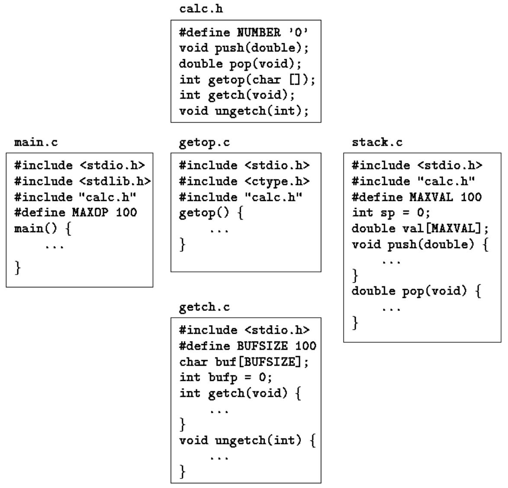

## Chapter 4 - Functions and Program Structure

Functions break large computing tasks into smaller ones, and enable people to build on what others have done instead of starting over from scratch. Appropriate functions hide details of operation from parts of the program that don't need to know about them, thus clarifying the whole, and easing the pain of making changes. 

函数把大的计算任务分解成若干较小的任务，并使人们可以在他人已完成的工作的基础上进行构建，而不必一切从头开始。恰当的函数可以把与操作无关的细节对程序中不需要了解它们的部分隐藏起来，从而使整个程序更清晰，也减轻了修改所带来的痛苦。

C has been designed to make functions efficient and easy to use; C programs generally consist of many small functions rather than a few big ones. A program may reside in one or more source files. Source files may be compiled separately and loaded together, along with previously compiled functions from libraries. We will not go into that process here, however, since the details vary from system to system. 

C 在设计上把函数做得高效且易用；C 程序通常由许多小函数而不是少数大函数构成。程序可以存放在一个或多个源文件中。源文件可以分别编译，并与来自库的、先前已编译的函数一起加载。这里我们不深入这个过程，因为细节因系统而异。

Function declaration and definition is the area where the ANSI standard has made the most changes to C. As we saw first in Chapter 1, it is now possible to declare the type of arguments when a function is declared. The syntax of function declaration also changes, so that declarations and definitions match. This makes it possible for a compiler to detect many more errors than it could before. Furthermore, when arguments are properly declared, appropriate type coercions are performed automatically. 

函数的声明和定义是 ANSI 标准对 C 改动最多的方面。正如第 1 章最先看到的那样，现在可以在声明函数的同时声明参数的类型。函数声明的语法也有变化，使得声明与定义相匹配。这使得编译器能够比以前检测出更多的错误。此外，当参数被恰当地声明后，适当的类型强制转换会自动进行。

The standard clarifies the rules on the scope of names; in particular, it requires that there be only one definition of each external object. Initialization is more general: automatic arrays and structures may now be initialized. 

标准澄清了名字作用域方面的规则；特别是，它要求每个外部对象只能有一个定义。初始化也更一般了：自动数组和结构现在都可以初始化。

The C preprocessor has also been enhanced. New preprocessor facilities include a more complete set of conditional compilation directives, a way to create quoted strings from macro arguments, and better control over the macro expansion process. 

C 预处理器也得到了增强。新的预处理器功能包括一套更完整的条件编译指令、一种从宏参数创建带引号字符串的方法，以及对宏展开过程更好的控制。

## 4.1 Basics of Functions

To begin with, let us design and write a program to print each line of its input that contains a particular "pattern" or string of characters. (This is a special case of the UNIX program grep.) For example, searching for the pattern of letters "ould" in the set of lines 

首先，让我们设计并编写一个程序，打印其输入中包含特定"模式"（pattern）或字符串的每一行。（这是 UNIX 程序 grep 的一个特例。）例如，在下面几行中搜索字母模式 "ould"：

```txt
Ah Love! could you and I with Fate conspire
To grasp this sorry Scheme of Things entire,
Would not we shatter it to bits -- and then
Re-mould it nearer to the Heart's Desire!
```

will produce the output 

将产生如下输出：

```txt
Ah Love! could you and I with Fate conspire
Would not we shatter it to bits -- and then
Re-mould it nearer to the Heart's Desire!
```

The job falls neatly into three pieces: 

这项工作可以顺理成章地分成三块：

```txt
while (there's another line)
    if (the line contains the pattern)
    print it 
```

虽然把所有代码都放在 main 中当然也可以，但更好的办法是利用上述结构，把每一部分做成单独的函数。三小块比一大块更容易处理，因为不相关的细节可以埋藏在函数中，不想要的相互影响的机会也被降到最低。而且这些部分甚至可能在其他程序中派上用场。

"While there's another line" is getline, a function that we wrote in Chapter 1, and "print it" is printf, which someone has already provided for us. This means we need only write a routine to decide whether the line contains an occurrence of the pattern. 

"还有下一行"就是 getline——第 1 章中我们编写的一个函数；"打印它"则是 printf——别人已经为我们准备好了。这意味着我们只需要编写一个例程来判断行中是否包含该模式。

We can solve that problem by writing a function strindex(s,t) that returns the position or index in the string s where the string t begins, or -1 if s does not contain t. Because C arrays begin at position zero, indexes will be zero or positive, and so a negative value like -1 is convenient for signaling failure. When we later need more sophisticated pattern matching, we only have to replace strindex; the rest of the code can remain the same. (The standard library provides a function strstr that is similar to strindex, except that it returns a pointer instead of an index.) 

我们可以通过编写函数 strindex(s,t) 来解决这个问题，它返回字符串 t 在字符串 s 中开始的位置或下标；如果 s 不包含 t，则返回 -1。因为 C 数组从位置零开始，下标将是零或正数，所以像 -1 这样的负值便于表示失败。以后需要更复杂的模式匹配时，只需替换 strindex，其余代码可以保持不变。（标准库提供了一个与 strindex 类似的函数 strstr，不同的是它返回的是指针而不是下标。）

Given this much design, filling in the details of the program is straightforward. Here is the whole thing, so you can see how the pieces fit together. For now, the pattern to be searched for is a literal string, which is not the most general of mechanisms. We will return shortly to a discussion of how to initialize character arrays, and in Chapter 5 will show how to make the pattern a parameter that is set when the program is run. There is also a slightly different version of getline; you might find it instructive to compare it to the one in Chapter 1. 

有了这些设计，填充程序的细节就直截了当了。下面是完整的程序，你可以看到各部分是如何组合在一起的。目前，要搜索的模式是一个字面字符串，这并不是最一般的机制。我们很快会回到如何初始化字符数组的讨论，第 5 章将展示如何把模式变成程序运行时才设置的参数。这里还有一个稍有不同版本的 getline；把它与第 1 章中的版本比较，你或许会从中受到启发。

```c
#include <stdio.h>
#define MAXLINE 1000 /* maximum input line length */

int getline(char line[], int max);
int strindex(char source[], char searchfor[]);

char pattern[] = "ould";    /* pattern to search for */

/* find all lines matching pattern */
main()
{
    char line[MAXLINE];
    int found = 0;

    while (getline(line, MAXLINE) > 0)
    if (strindex(line, pattern) >= 0) {
    printf("%s", line);
    found++;
    }
    return found;
}

/* getline: get line into s, return length */
int getline(char s[], int lim)
{
    int c, i;

    i = 0;
    while (--lim > 0 && (c=getchar()) != EOF && c != '\n')
    s[i++] = c;
    if (c == '\n')
    s[i++] = c; 
    s[i] = '\0';
    return i;
}
/* strindex: return index of t in s, -1 if none */
int strindex(char s[], char t[])
{
    int i, j, k;

    for (i = 0; s[i] != '\0'; i++) {
    for (j=i, k=0; t[k] != '\0' && s[j]==t[k]; j++, k++)
    ;
    if (k > 0 && t[k] == '\0')
    return i;
    }
    return -1;
} 
```

Each function definition has the form 

每个函数定义的形式是

```c
return-type function-name(argument declarations)
{
    declarations and statements
}
```

Various parts may be absent; a minimal function is 

其中各个部分都可以缺省；一个最小的函数是

```c
dummy() {} 
```

which does nothing and returns nothing. A do-nothing function like this is sometimes useful as a place holder during program development. If the return type is omitted, int is assumed. 

它什么都不做，也不返回任何值。像这样的空函数有时可以在程序开发过程中用作占位符。如果省略了返回类型，就假定是 int。

A program is just a set of definitions of variables and functions. Communication between the functions is by arguments and values returned by the functions, and through external variables. The functions can occur in any order in the source file, and the source program can be split into multiple files, so long as no function is split. 

程序就是一组变量和函数的定义。函数之间的通信靠参数和函数返回的值，以及外部变量来进行。函数在源文件中可以以任意顺序出现，源程序也可以拆分成多个文件，只要不把函数拆开。

The return statement is the mechanism for returning a value from the called function to its caller. Any expression can follow return: 

return 语句是把值从被调用函数返回给其调用者的机制。return 后面可以跟任何表达式：

```c
return expression;
```

The expression will be converted to the return type of the function if necessary. Parentheses are often used around the expression, but they are optional. 

必要时，表达式会被转换为函数的返回类型。表达式周围常用圆括号，但这是可选的。

The calling function is free to ignore the returned value. Furthermore, there need to be no expression after return; in that case, no value is returned to the caller. Control also returns to the caller with no value when execution "falls off the end" of the function by reaching the closing right brace. It is not illegal, but probably a sign of trouble, if a function returns a value from one place and no value from another. In any case, if a function fails to return a value, its "value" is certain to be garbage. 

调用函数可以随意忽略返回值。此外，return 后面也可以没有表达式；在这种情况下，不向调用者返回值。当执行"从函数末尾掉出"（到达结尾的右花括号）时，控制同样以无值的方式返回调用者。如果一个函数从一个位置返回值而从另一个位置不返回值，这虽然不算非法，但很可能是出问题的迹象。无论如何，如果一个函数没有返回值，它的"值"肯定是垃圾。

The pattern-searching program returns a status from main, the number of matches found. This value is available for use by the environment that called the program 

模式搜索程序从 main 返回一个状态，即找到的匹配数目。这个值可供调用该程序的环境使用。

The mechanics of how to compile and load a C program that resides on multiple source files vary from one system to the next. On the UNIX system, for example, the cc command mentioned in Chapter 1 does the job. Suppose that the three functions are stored in three files called main.c, getline.c, and strindex.c. Then the command 

编译和加载驻留在多个源文件中的 C 程序的具体方法因系统而异。例如在 UNIX 系统上，第 1 章提到的 cc 命令就能完成这项工作。假设这三个函数分别存放在名为 main.c、getline.c 和 strindex.c 的三个文件中，那么命令

```c
cc main.c getline.c strindex.c 
```

compiles the three files, placing the resulting object code in files main.o, getline.o, and strindex.o, then loads them all into an executable file called a.out. If there is an error, say in main.c, the file can be recompiled by itself and the result loaded with the previous object files, with the command 

将编译这三个文件，把得到的目标代码放在文件 main.o、getline.o 和 strindex.o 中，然后把它们全部加载成一个叫 a.out 的可执行文件。如果有错误，比如说在 main.c 中，可以单独重新编译该文件，并把结果与先前的目标文件一起加载，命令是

```c
cc main.c getline.o strindex.o
```

The cc command uses the ".c" versus ".o" naming convention to distinguish source files from object files. 

cc 命令利用 “.c” 与 “.o” 的命名约定来区分源文件和目标文件。

Exercise 4-1. Write the function strindex(s,t) which returns the position of the rightmost occurrence of t in s, or -1 if there is none. 

练习 4-1. 编写函数 strindex(s,t)，它返回字符串 t 在 s 中最右边一次出现的位置；如果没有出现，则返回 -1。

## 4.2 Functions Returning Non-integers

So far our examples of functions have returned either no value (void) or an int. What if a function must return some other type? many numerical functions like sqrt, sin, and cos return double; other specialized functions return other types. To illustrate how to deal with this, let us write and use the function atof(s), which converts the string s to its doubleprecision floating-point equivalent. atof if an extension of atoi, which we showed versions of in Chapters 2 and 3. It handles an optional sign and decimal point, and the presence or absence of either part or fractional part. Our version is not a high-quality input conversion routine; that would take more space than we care to use. The standard library includes an atof; the header <stdlib.h> declares it. 

到目前为止，我们的函数例子要么不返回值（void），要么返回 int。如果函数必须返回其他类型怎么办？许多数值函数如 sqrt、sin 和 cos 返回 double；其他一些专用函数返回别的类型。为了说明如何处理这种情况，我们来编写并使用函数 atof(s)，它把字符串 s 转换为其等价的 double 精度浮点值。atof 是 atoi 的扩展，我们在第 2 章和第 3 章给出过 atoi 的版本。它能处理可选的符号和小数点，以及整数部分或小数部分的存在与否。我们的版本并不是高质量的输入转换例程；那样会占用比我们愿意使用的更多篇幅。标准库中有一个 atof，头文件 <stdlib.h> 声明了它。

First, atof itself must declare the type of value it returns, since it is not int. The type name precedes the function name: 

首先，atof 自身必须声明它返回值的类型，因为它不是 int。类型名放在函数名之前：

```c
#include <ctype.h>

/* atof: convert string s to double */
double atof(char s[])
{
    double val, power;
    int i, sign;

    for (i = 0; isspace(s[i]); i++) /* skip white space */
    ;
    sign = (s[i] == '-') ? -1 : 1;
    if (s[i] == '+' || s[i] == '-' )
    i++;
    for (val = 0.0; isdigit(s[i]); i++)
    val = 10.0 * val + (s[i] - '0');
    if (s[i] == '.')
    i++;
    for (power = 1.0; isdigit(s[i]); i++) {
    val = 10.0 * val + (s[i] - '0');
    power *= 10;
    }
    return sign * val / power;
} 
```

Second, and just as important, the calling routine must know that atof returns a non-int value. One way to ensure this is to declare atof explicitly in the calling routine. The declaration is shown in this primitive calculator (barely adequate for check-book balancing), which reads one number per line, optionally preceded with a sign, and adds them up, printing the running sum after each input: 

其次，同样重要的是，调用例程必须知道 atof 返回的不是 int 值。确保这一点的一种方法是在调用例程中显式声明 atof。下面这个简易计算器（勉强够用来核对支票簿）中就给出了这一声明，它每行读入一个数（前面可带符号），把它们累加起来，并在每次输入后打印累计和：

```c
double atof(); 
```

```c
#include <stdio.h>
#define MAXLINE 100
    /* rudimentary calculator */
main()
{
    double sum, atof(char []);
    char line[MAXLINE];
    int getline(char line[], int max);

    sum = 0;
    while (getline(line, MAXLINE) > 0)
    printf("\t%g\n", sum += atof(line));
    return 0;
}
```

The declaration 

这一声明

```c
double sum, atof(char []);
```

says that sum is a double variable, and that atof is a function that takes one char[] argument and returns a double. 

说明 sum 是一个 double 变量，而 atof 是一个函数，它接受一个 char[] 参数并返回一个 double。

The function atof must be declared and defined consistently. If atof itself and the call to it in main have inconsistent types in the same source file, the error will be detected by the compiler. But if (as is more likely) atof were compiled separately, the mismatch would not be detected, atof would return a double that main would treat as an int, and meaningless answers would result. 

函数 atof 必须一致地声明和定义。如果 atof 自身与 main 中对它的调用在同一个源文件中类型不一致，错误会被编译器检测出来。但如果（这更可能）atof 是单独编译的，类型不匹配就不会被检测到，atof 会返回一个 double 而 main 却把它当作 int，结果将是毫无意义的答案。

In the light of what we have said about how declarations must match definitions, this might seem surprising. The reason a mismatch can happen is that if there is no function prototype, a function is implicitly declared by its first appearance in an expression, such as 

鉴于我们前面说过声明必须与定义相匹配，这看起来可能令人惊讶。类型不匹配之所以可能发生，是因为如果没有函数原型，函数会在它于表达式中第一次出现时被隐式声明，比如

```c
sum += atof(line)
```

If a name that has not been previously declared occurs in an expression and is followed by a left parentheses, it is declared by context to be a function name, the function is assumed to return an int, and nothing is assumed about its arguments. Furthermore, if a function declaration does not include arguments, as in 

如果一个以前没有声明过的名字出现在表达式中且后面跟着一个左圆括号，根据上下文它会被声明为函数名，该函数被假定返回 int，并且对其参数不做任何假定。此外，如果函数声明不包含参数，如下所示

```c
double atof();
```

that too is taken to mean that nothing is to be assumed about the arguments of atof; all parameter checking is turned off. This special meaning of the empty argument list is intended to permit older C programs to compile with new compilers. But it's a bad idea to use it with new C programs. If the function takes arguments, declare them; if it takes no arguments, use void. 

那么同样意味着对 atof 的参数不做任何假定；所有参数检查都被关闭。空参数表的这种特殊含义是为了让旧的 C 程序能用新的编译器编译。但在新的 C 程序中使用它是个坏主意。如果函数接受参数，就声明它们；如果不接受参数，就使用 void。

Given atof, properly declared, we could write atoi (convert a string to int) in terms of it: 

有了已正确声明的 atof，我们就可以用它来编写 atoi（把字符串转换为 int）：

```c
/* atoi: convert string s to integer using atof */
int atoi(char s[])
{
    double atof(char s[]);
    return (int) atof(s);
}
```

Notice the structure of the declarations and the return statement. The value of the expression in 

注意声明和 return 语句的结构。下面语句中

```c
return expression;
```

is converted to the type of the function before the return is taken. Therefore, the value of atof, a double, is converted automatically to int when it appears in this return, since the function atoi returns an int. This operation does potentionally discard information, however, so some compilers warn of it. The cast states explicitly that the operation is intended, and suppresses any warning. 

表达式的值在执行返回之前会被转换为函数的类型。因此，atof 的值（一个 double）出现在这个 return 中时，会被自动转换为 int，因为函数 atoi 返回的是 int。不过这一操作有可能丢弃信息，所以有些编译器会对此发出警告。强制转换明确表示该操作是有意为之，并消除任何警告。

Exercise 4-2. Extend atof to handle scientific notation of the form 

练习 4-2. 扩展 atof，使它能处理形如

```txt
123.45e-6 
```

where a floating-point number may be followed by e or E and an optionally signed exponent. 

的科学计数法，其中浮点数后面可以跟 e 或 E 以及一个可以带符号的指数。

## 4.3 External Variables

A C program consists of a set of external objects, which are either variables or functions. The adjective "external" is used in contrast to "internal", which describes the arguments and variables defined inside functions. External variables are defined outside of any function, and are thus potentionally available to many functions. Functions themselves are always external, because C does not allow functions to be defined inside other functions. By default, external variables and functions have the property that all references to them by the same name, even from functions compiled separately, are references to the same thing. (The standard calls this property external linkage.) In this sense, external variables are analogous to Fortran COMMON blocks or variables in the outermost block in Pascal. We will see later how to define external variables and functions that are visible only within a single source file. Because external variables are globally accessible, they provide an alternative to function arguments and return values for communicating data between functions. Any function may access an external variable by referring to it by name, if the name has been declared somehow. 

C 程序由一组外部对象组成，它们要么是变量，要么是函数。形容词"外部"（external）与"内部"（internal）相对使用，后者描述在函数内部定义的参数和变量。外部变量定义在任何函数之外，因此可能被许多函数使用。函数本身总是外部的，因为 C 不允许在一个函数内部定义另一个函数。默认情况下，外部变量和函数具有这样的性质：即使它们被分别编译的函数通过相同的名字引用，所引用的也是同一个东西。（标准把这个性质称为外部链接，external linkage。）在这个意义上，外部变量类似于 Fortran 的 COMMON 块或 Pascal 最外层块中的变量。后面我们将看到如何定义只在单个源文件内可见的外部变量和函数。由于外部变量是全局可访问的，它们为函数之间传递数据提供了一种替代函数参数和返回值的方式。只要名字已以某种方式声明过，任何函数都可以通过名字访问外部变量。

If a large number of variables must be shared among functions, external variables are more convenient and efficient than long argument lists. As pointed out in Chapter 1, however, this reasoning should be applied with some caution, for it can have a bad effect on program structure, and lead to programs with too many data connections between functions. 

如果大量变量必须在函数间共享，使用外部变量比长长的参数表更方便、更高效。然而，正如第 1 章所指出的，这种推理应当谨慎应用，因为它可能对程序结构产生不良影响，导致函数之间有太多数据连接的程序。

External variables are also useful because of their greater scope and lifetime. Automatic variables are internal to a function; they come into existence when the function is entered, and disappear when it is left. External variables, on the other hand, are permanent, so they can retain values from one function invocation to the next. Thus if two functions must share some data, yet neither calls the other, it is often most convenient if the shared data is kept in external variables rather than being passed in and out via arguments. 

外部变量之所以有用，还因为它们具有更大的作用域和更长的生存期。自动变量是函数内部的；它们在进入函数时产生，离开函数时消失。而外部变量是永久的，因此可以把值从一个函数调用保持到下一次。所以，如果两个函数必须共享一些数据，但彼此都不调用对方，那么把共享数据放在外部变量中通常最方便，而不是通过参数传进传出。

Let us examine this issue with a larger example. The problem is to write a calculator program that provides the operators +, -, * and /. Because it is easier to implement, the calculator will use reverse Polish notation instead of infix. (Reverse Polish notation is used by some pocket calculators, and in languages like Forth and Postscript.) 

让我们用一个更大的例子来考察这个问题。问题是编写一个提供 +、-、* 和 / 运算符的计算器程序。因为更容易实现，计算器将使用逆波兰表示法（reverse Polish notation）而不是中缀表示法。（某些袖珍计算器以及 Forth 和 Postscript 等语言使用逆波兰表示法。）

In reverse Polish notation, each operator follows its operands; an infix expression like 

在逆波兰表示法中，每个运算符跟在它的操作数之后；像下面这样的中缀表达式

```c
(1 - 2) * (4 + 5)
```

is entered as 

按如下方式输入：

```c
1 2 - 4 5 + * 
```

Parentheses are not needed; the notation is unambiguous as long as we know how many operands each operator expects. 

圆括号并不需要；只要知道每个运算符需要多少个操作数，这种表示法就是无歧义的。

The implementation is simple. Each operand is pushed onto a stack; when an operator arrives, the proper number of operands (two for binary operators) is popped, the operator is applied to them, and the result is pushed back onto the stack. In the example above, for instance, 1 and 2 are pushed, then replaced by their difference, -1. Next, 4 and 5 are pushed and then replaced by their sum, 9. The product of -1 and 9, which is -9, replaces them on the stack. The value on the top of the stack is popped and printed when the end of the input line is encountered. 

实现很简单。每个操作数被压入栈中；当一个运算符到达时，弹出合适数目的操作数（对二元运算符是两个），把运算符应用于它们，再把结果压回栈中。例如在上面的例子中，先压入 1 和 2，然后把它们替换为它们的差 -1。接着压入 4 和 5，然后把它们替换为它们的和 9。-1 和 9 的乘积 -9 又替换它们在栈中的位置。遇到输入行结尾时，弹出并打印栈顶的值。

The structure of the program is thus a loop that performs the proper operation on each operator and operand as it appears: 

因此，程序的结构就是一个循环，它对每出现的运算符和操作数执行相应的操作：

```txt
while (next operator or operand is not end-of-file indicator)
    if (number)
    push it
    else if (operator)
    pop operands
    do operation
    push result
    else if (newline)
    pop and print top of stack
    else
    error 
```

The operation of pushing and popping a stack are trivial, but by the time error detection and recovery are added, they are long enough that it is better to put each in a separate function than to repeat the code throughout the whole program. And there should be a separate function for fetching the next input operator or operand. 

入栈和出栈的操作本身很简单，但一旦加上了错误检测和恢复的处理，它们就足够长，最好各自放在单独的函数中，而不是在整个程序中重复这些代码。另外还应该有一个单独的函数来获取下一个输入的运算符或操作数。

The main design decision that has not yet been discussed is where the stack is, that is, which routines access it directly. On possibility is to keep it in main, and pass the stack and the current stack position to the routines that push and pop it. But main doesn't need to know about the variables that control the stack; it only does push and pop operations. So we have decided to store the stack and its associated information in external variables accessible to the push and pop functions but not to main. 

还有一个尚未讨论的主要设计决策是：栈放在哪里，也就是说，哪些例程可以直接访问它。一种可能的做法是把栈保存在 main 中，把栈和当前栈顶位置传给执行入栈和出栈的例程。但 main 并不需要知道控制栈的那些变量，它只做入栈和出栈操作。所以我们决定把栈及其相关信息存放在外部变量中，这些变量可以被 push 和 pop 函数访问，但不能被 main 访问。

Translating this outline into code is easy enough. If for now we think of the program as existing in one source file, it will look like this: 

把这个框架翻译成代码并不难。如果我们暂时假设程序全部位于一个源文件中，它的样子如下：

```c
#include's
#define's
```

function declarations for main 

```txt
main() { ... } 
```

external variables for push and pop 

```txt
void push( double f) { ... }
double pop(void) { ... }

int getop(char s[]) { ... }
routines called by getop 
```

Later we will discuss how this might be split into two or more source files. 

稍后我们将讨论如何把这个程序拆分成两个或多个源文件。

The function main is a loop containing a big switch on the type of operator or operand; this is a more typical use of switch than the one shown in Section 3.4. 

函数 main 是一个循环，其中包含一个针对运算符或操作数类型的大型 switch 语句；比起 3.4 节展示的用法，这是 switch 更典型的用法。

```c
#include <stdio.h>
#include <stdlib.h> /* for atof() */

#define MAXOP 100 /* max size of operand or operator */
#define NUMBER '0' /* signal that a number was found */

int getop(char []);
void push(double);
double pop(void);

/* reverse Polish calculator */
main()
{
    int type;
    double op2;
    char s[MAXOP];

    while ((type = getop(s)) != EOF) {
    switch (type) {
    case NUMBER:
    push(atof(s));
    break;
    case '+':
    push(pop() + pop());
    break;
    case '*':
    push(pop() * pop());
    break;
    case '-':
    op2 = pop();
    push(pop() - op2);
    break;
    case '/':
    op2 = pop();
    if (op2 != 0.0)
    push(pop() / op2);
    else
    printf("error: zero divisor\n");
    break;
    case '\n':
    printf("\t%.8g\n", pop());
    break;
    default:
    printf("error: unknown command %s\n", s);
    break;
    }
    }
    return 0;
} 
```

Because + and * are commutative operators, the order in which the popped operands are combined is irrelevant, but for - and / the left and right operand must be distinguished. In 

push(pop() - pop()); /* WRONG */

the order in which the two calls of pop are evaluated is not defined. To guarantee the right order, it is necessary to pop the first value into a temporary variable as we did in main. 

因为 + 和 * 是可交换的运算符，两个被弹出的操作数以什么顺序组合无关紧要；但对于 - 和 / 来说，左右操作数必须加以区分。在

```c
push(pop() - pop()); /* WRONG */
```

中，两次 pop 调用的求值顺序是没有定义的。为了保证正确的顺序，必须像我们在 main 中那样，先把第一个值弹出到一个临时变量中。

```c
#define MAXVAL 100 /* maximum depth of val stack */
int sp = 0;    /* next free stack position */
double val[MAXVAL]; /* value stack */

/* push: push f onto value stack */
void push(double f)
{
    if (sp < MAXVAL)
    val[sp++] = f;
    else
    printf("error: stack full, can't push %g\n", f);
}

/* pop: pop and return top value from stack */
double pop(void)
{
    if (sp > 0)
    return val[--sp];
    else {
    printf("error: stack empty\n");
    return 0.0;
    }
} 
```

A variable is external if it is defined outside of any function. Thus the stack and stack index that must be shared by push and pop are defined outside these functions. But main itself does not refer to the stack or stack position - the representation can be hidden. 

如果一个变量定义在任何函数之外，它就是外部变量。因此，必须由 push 和 pop 共享的栈和栈顶下标就定义在这两个函数之外。但 main 本身并不引用栈或栈的位置——这个表示方式可以被隐藏起来。

Let us now turn to the implementation of getop, the function that fetches the next operator or operand. The task is easy. Skip blanks and tabs. If the next character is not a digit or a hexadecimal point, return it. Otherwise, collect a string of digits (which might include a decimal point), and return NUMBER, the signal that a number has been collected. 

现在来看 getop 的实现，这个函数负责获取下一个运算符或操作数。任务很简单：跳过空格和制表符。如果下一个字符不是数字或小数点，就把它返回。否则，收集一个数字串（其中可能包含小数点），并返回 NUMBER，表示已经收集到一个数。

```c
#include <ctype.h>

int getch(void);
void ungetch(int);

/* getop: get next character or numeric operand */
int getop(char s[])
{
    int i, c;

    while ((s[0] = c = getch()) == ' ' || c == '\t')
    ;
    s[1] = '\0';
    if (!isdigit(c) && c != '.') 
    return c;    /* not a number */
    i = 0;
    if (isdigit(c))    /* collect integer part */
    while (isdigit(s[++i] = c = getch()))
    ;
    if (c == '.')    /* collect fraction part */
    while (isdigit(s[++i] = c = getch()))
    ;
    s[i] = '\0';
    if (c != EOF)
    ungetch(c);
    return NUMBER;
}
```

What are getch and ungetch? It is often the case that a program cannot determine that it has read enough input until it has read too much. One instance is collecting characters that make up a number: until the first non-digit is seen, the number is not complete. But then the program has read one character too far, a character that it is not prepared for. 

getch 和 ungetch 是什么？经常有这样的情况：程序只有在读了过多输入之后，才能确定它已经读够了。收集组成一个数的字符就是一个例子：在看到第一个非数字字符之前，这个数是不完整的。但此时程序已经多读了一个字符，一个它还没有准备好的字符。

The problem would be solved if it were possible to "un-read" the unwanted character. Then, every time the program reads one character too many, it could push it back on the input, so the rest of the code could behave as if it had never been read. Fortunately, it's easy to simulate un-getting a character, by writing a pair of cooperating functions. getch delivers the next input character to be considered; ungetch will return them before reading new input. 

如果能够把不需要的字符“退回”（un-read），问题就解决了。这样，每当程序多读了一个字符，就可以把它压回输入中，使程序的其余部分表现得好像从未读过它一样。幸运的是，通过编写一对互相配合的函数，很容易模拟“退回一个字符”的操作。getch 提供下一个要考虑的输入字符；ungetch 则在读取新输入之前把它们退回。

How they work together is simple. ungetch puts the pushed-back characters into a shared buffer -- a character array. getch reads from the buffer if there is anything else, and calls getchar if the buffer is empty. There must also be an index variable that records the position of the current character in the buffer. 

它们协同工作的方式很简单。ungetch 把退回的字符放进一个共享缓冲区——一个字符数组。如果缓冲区里还有内容，getch 就从缓冲区读取；缓冲区为空时才调用 getchar。还需要一个下标变量，记录缓冲区中当前字符的位置。

Since the buffer and the index are shared by getch and ungetch and must retain their values between calls, they must be external to both routines. Thus we can write getch, ungetch, and their shared variables as: 

由于缓冲区和下标由 getch 和 ungetch 共享，并且在两次调用之间必须保留其值，所以它们必须是这两个例程外部的变量。于是，我们可以这样编写 getch、ungetch 及其共享变量：

```c
#define BUFSIZE 100

char buf[BUFSIZE];    /* buffer for ungetch */
int bufp = 0;    /* next free position in buf */

int getch(void)    /* get a (possibly pushed-back) character */
{
    return (bufp > 0) ? buf[--bufp] : getchar();
}

void ungetch(int c)    /* push character back on input */
{
    if (bufp >= BUFSIZE)
    printf("ungetch: too many characters\n");
    else
    buf[bufp++] = c;
} 
```

The standard library includes a function ungetch that provides one character of pushback; we will discuss it in Chapter 7. We have used an array for the pushback, rather than a single character, to illustrate a more general approach. 

标准库中提供了一个提供单字符退回功能的 ungetch 函数；我们将在第 7 章讨论它。我们使用数组而不是单个字符来实现退回，是为了演示一种更通用的方法。

Exercise 4-3. Given the basic framework, it's straightforward to extend the calculator. Add the modulus (%) operator and provisions for negative numbers. 

练习 4-3. 在这个基本框架下，扩展计算器是很直接的。增加取模（%）运算符，并考虑负数的情况。

Exercise 4-4. Add the commands to print the top elements of the stack without popping, to duplicate it, and to swap the top two elements. Add a command to clear the stack. 

练习 4-4. 增加一些命令：不弹出而打印栈顶元素、复制栈顶元素、交换最上面两个元素。再增加一个清空栈的命令。

Exercise 4-5. Add access to library functions like sin, exp, and pow. See <math.h> in Appendix B, Section 4 

练习 4-5. 增加对 sin、exp、pow 等库函数的访问。参见附录 B 第 4 节的 <math.h>。

Exercise 4-6. Add commands for handling variables. (It's easy to provide twenty-six variables with single-letter names.) Add a variable for the most recently printed value. 

练习 4-6. 增加处理变量的命令。（提供 26 个以单字母命名的变量很容易。）再增加一个保存最近打印值的变量。

Exercise 4-7. Write a routine ungets(s) that will push back an entire string onto the input. Should ungets know about buf and bufp, or should it just use ungetch? 

练习 4-7. 编写一个例程 ungets(s)，把整个字符串退回到输入中。ungets 应该知道 buf 和 bufp，还是只使用 ungetch？

Exercise 4-8. Suppose that there will never be more than one character of pushback. Modify getch and ungetch accordingly. 

练习 4-8. 假设退回的字符永远不会超过一个。相应地修改 getch 和 ungetch。

Exercise 4-9. Our getch and ungetch do not handle a pushed-back EOF correctly. Decide what their properties ought to be if an EOF is pushed back, then implement your design. 

练习 4-9. 我们的 getch 和 ungetch 不能正确处理退回的 EOF。请决定如果一个 EOF 被退回，它们应当具有什么性质，然后实现你的设计。

Exercise 4-10. An alternate organization uses getline to read an entire input line; this makes getch and ungetch unnecessary. Revise the calculator to use this approach. 

练习 4-10. 另一种组织方式是用 getline 读入整个输入行；这使得 getch 和 ungetch 变得没有必要。请修改计算器，采用这种方法。

## 4.4 Scope Rules

The functions and external variables that make up a C program need not all be compiled at the same time; the source text of the program may be kept in several files, and previously compiled routines may be loaded from libraries. Among the questions of interest are 

构成一个 C 程序的函数和外部变量不必同时全部编译；程序的源文本可以存放在多个文件中，先前编译好的例程可以从库中加载。一些值得关心的问题是

• How are declarations written so that variables are properly declared during compilation? 

• 声明如何书写，才能使变量在编译时被正确声明？

• How are declarations arranged so that all the pieces will be properly connected when the program is loaded? 

• 声明如何安排，才能使程序加载时各部分正确地连接起来？

• How are declarations organized so there is only one copy? 

• 声明如何组织，才能保证只有一份副本？

• How are external variables initialized? 

• 外部变量如何初始化？

Let us discuss these topics by reorganizing the calculator program into several files. As a practical matter, the calculator is too small to be worth splitting, but it is a fine illustration of the issues that arise in larger programs. 

我们来通过把计算器程序重新组织到几个文件中，讨论这些话题。从实际情况来看，这个计算器太小了，不值得拆分，但它很好地展示了在更大的程序中会出现的问题。

The scope of a name is the part of the program within which the name can be used. For an automatic variable declared at the beginning of a function, the scope is the function in which the name is declared. Local variables of the same name in different functions are unrelated. The same is true of the parameters of the function, which are in effect local variables. 

名字的作用域是程序中可以使用该名字的部分。对于在函数开头声明的自动变量来说，其作用域就是声明该名字的函数。不同函数中同名的局部变量互不相关。函数的参数也是如此，参数实际上就是局部变量。

The scope of an external variable or a function lasts from the point at which it is declared to the end of the file being compiled. For example, if main, sp, val, push, and pop are defined in one file, in the order shown above, that is, 

外部变量或函数的作用域从声明它的地方开始，到（正在编译的）文件末尾结束。例如，如果 main、sp、val、push 和 pop 按上面所示的顺序定义在一个文件中，也就是

```txt
main() { ... }
int sp = 0;
double val[MAXVAL];
void push(double f) { ... }
double pop(void) { ... } 
```

then the variables sp and val may be used in push and pop simply by naming them; no further declarations are needed. But these names are not visible in main, nor are push and pop themselves. 

那么，sp 和 val 这两个变量在 push 和 pop 中可以直接通过名字使用，不需要再作声明。但这些名字在 main 中是不可见的，push 和 pop 这两个名字本身在 main 中同样不可见。

On the other hand, if an external variable is to be referred to before it is defined, or if it is defined in a different source file from the one where it is being used, then an extern declaration is mandatory. 

另一方面，如果要在一个外部变量定义之前引用它，或者它定义在与使用处不同的源文件中，那么 extern 声明就是必不可少的。

It is important to distinguish between the declaration of an external variable and its definition. A declaration announces the properties of a variable (primarily its type); a definition also causes storage to be set aside. If the lines 

区分外部变量的声明（declaration）和定义（definition）很重要。声明只是说明变量的性质（主要是类型）；定义则还会引起存储空间的分配。如果有这样几行

```txt
int sp;
double val[MAXVAL]; 
```

appear outside of any function, they define the external variables sp and val, cause storage to be set aside, and also serve as the declarations for the rest of that source file. On the other hand, the lines 

出现在任何函数之外，它们就定义了外部变量 sp 和 val，引起存储空间的分配，并且充当该源文件其余部分的声明。而另一方面，下面几行

```txt
extern int sp;
extern double val[]; 
```

declare for the rest of the source file that sp is an int and that val is a double array (whose size is determined elsewhere), but they do not create the variables or reserve storage for them. 

是向源文件的其余部分声明：sp 是一个 int，val 是一个 double 数组（其大小在别处确定），但它们并不创建这些变量，也不为它们保留存储空间。

There must be only one definition of an external variable among all the files that make up the source program; other files may contain extern declarations to access it. (There may also be extern declarations in the file containing the definition.) Array sizes must be specified with the definition, but are optional with an extern declaration. 

在组成源程序的所有文件中，一个外部变量只能有一个定义；其他文件可以通过 extern 声明来访问它。（含有定义的文件中也可以有 extern 声明。）数组的大小必须随定义一起指定，但在 extern 声明中则是可选的。

Initialization of an external variable goes only with the definition. 

外部变量的初始化只能出现在定义中。

Although it is not a likely organization for this program, the functions push and pop could be defined in one file, and the variables val and sp defined and initialized in another. Then these definitions and declarations would be necessary to tie them together: 

虽然对这个程序来说不太可能这样组织，但 push 和 pop 函数可以定义在一个文件中，而 val 和 sp 变量在另一个文件中定义并初始化。那么就需要下面这些定义和声明把它们联系在一起：

in file1: 

```c
extern int sp;
extern double val[];
void push(double f) { ... }
double pop(void) { ... }
```

in file2: 

```c
int sp = 0;
double val[MAXVAL];
```

Because the extern declarations in file1 lie ahead of and outside the function definitions, they apply to all functions; one set of declarations suffices for all of file1. This same organization would also bee needed if the definition of sp and val followed their use in one file. 

由于 file1 中的 extern 声明位于函数定义之前且在函数之外，它们对所有函数都有效；一组声明就足以覆盖整个 file1。如果在同一个文件中 sp 和 val 的定义出现在它们被使用之后，也需要同样这样组织。

## 4.5 Header Files

Let is now consider dividing the calculator program into several source files, as it might be is each of the components were substantially bigger. The main function would go in one file, which we will call main.c; push, pop, and their variables go into a second file, stack.c; getop goes into a third, getop.c. Finally, getch and ungetch go into a fourth file, getch.c; we separate them from the others because they would come from a separately-compiled library in a realistic program. 

现在来考虑把计算器程序拆分成几个源文件，就好像各组成部分要大得多时那样。main 函数放在一个文件中，我们称之为 main.c；push、pop 及它们的变量放进第二个文件 stack.c；getop 放进第三个文件 getop.c。最后，getch 和 ungetch 放进第四个文件 getch.c；把它们与其他部分分开，是因为在一个实际的程序中，它们会来自一个单独编译的库。

There is one more thing to worry about - the definitions and declarations shared among files. As much as possible, we want to centralize this, so that there is only one copy to get and keep right as the program evolves. Accordingly, we will place this common material in a header file, calc.h, which will be included as necessary. (The #include line is described in Section 4.11.) The resulting program then looks like this: 

还有一件事需要考虑——在各文件之间共享的定义和声明。我们希望尽可能把这些内容集中起来，使得随着程序的演进，只有一份副本需要获取和保持正确。因此，我们把这些公共内容放在一个头文件 calc.h 中，需要时就包含它。（#include 行将在 4.11 节描述。）这样得到的程序看起来如下：




There is a tradeoff between the desire that each file have access only to the information it needs for its job and the practical reality that it is harder to maintain more header files. Up to some moderate program size, it is probably best to have one header file that contains everything that is to be shared between any two parts of the program; that is the decision we made here. For a much larger program, more organization and more headers would be needed. 

一方面希望每个文件只访问完成其工作所需的信息，另一方面现实是维护更多的头文件更加困难，这两者之间需要权衡。对于中等规模的程序来说，最好只用一个头文件，包含程序中任意两部分之间要共享的所有内容；我们在这里采取的就是这个做法。对于大得多的程序，则需要更多的组织和更多的头文件。

## 4.6 Static Variables

The variables sp and val in stack.c, and buf and bufp in getch.c, are for the private use of the functions in their respective source files, and are not meant to be accessed by anything else. The static declaration, applied to an external variable or function, limits the scope of that object to the rest of the source file being compiled. External static thus provides a way to hide names like buf and bufp in the getch-ungetch combination, which must be external so they can be shared, yet which should not be visible to users of getch and ungetch. 

stack.c 中的变量 sp 和 val，以及 getch.c 中的 buf 和 bufp，是供各自源文件中的函数专用的，不应被其他任何东西访问。static 声明作用于外部变量或函数时，会把该对象的作用域限制在正在编译的源文件的其余部分之内。因此，外部 static 提供了一种隐藏名字（如 getch-ungetch 组合中的 buf 和 bufp）的方法：它们必须是外部的才能被共享，但又不应对 getch 和 ungetch 的使用者可见。

Static storage is specified by prefixing the normal declaration with the word static. If the two routines and the two variables are compiled in one file, as in 

静态存储通过在普通声明前加上 static 一词来指定。如果这两个例程和这两个变量编译在同一个文件中，如下所示

```c
static char buf[BUFSIZE]; /* buffer for ungetch */
static int bufp = 0;    /* next free position in buf */

int getch(void) { ... }

void ungetch(int c) { ... } 
```

then no other routine will be able to access buf and bufp, and those names will not conflict with the same names in other files of the same program. In the same way, the variables that push and pop use for stack manipulation can be hidden, by declaring sp and val to be static. 

这样，其他例程就无法访问 buf 和 bufp 了，这两个名字也不会与同一程序其他文件中的同名对象发生冲突。同样，把 sp 和 val 声明为 static，也可以隐藏 push 和 pop 用于栈操作的变量。

The external static declaration is most often used for variables, but it can be applied to functions as well. Normally, function names are global, visible to any part of the entire program. If a function is declared static, however, its name is invisible outside of the file in which it is declared. 

外部 static 声明最常用于变量，但也可以用于函数。通常，函数名是全局的，对整个程序的任何部分都可见。但是，如果一个函数被声明为 static，那么它的名字在声明它的文件之外是不可见的。

The static declaration can also be applied to internal variables. Internal static variables are local to a particular function just as automatic variables are, but unlike automatics, they remain in existence rather than coming and going each time the function is activated. This means that internal static variables provide private, permanent storage within a single function. 

static 声明也可以用于内部变量。内部 static 变量和自动变量一样只属于某个特定函数的局部，但与自动变量不同，它们一直存在，而不是在函数每次被激活时产生和消失。这意味着内部 static 变量在单个函数内部提供了私有的、永久性的存储。

Exercise 4-11. Modify getop so that it doesn't need to use ungetch. Hint: use an internal static variable. 

练习 4-11. 修改 getop，使它不需要使用 ungetch。提示：使用一个内部 static 变量。

## 4.7 Register Variables

A register declaration advises the compiler that the variable in question will be heavily used. The idea is that register variables are to be placed in machine registers, which may result in smaller and faster programs. But compilers are free to ignore the advice. 

register 声明告诉编译器，所讨论的变量将被频繁使用。其想法是把 register 变量放在机器的寄存器中，这样可能产生更小更快的程序。但编译器可以自由地忽略这一建议。

The register declaration looks like 

```txt
register int x;
register char c; 
```

and so on. The register declaration can only be applied to automatic variables and to the formal parameters of a function. In this later case, it looks like 

等等。register 声明只能用于自动变量和函数的形参。对于后一种情况，写法如下

```c
f(register unsigned m, register long n)
{
    register int i;
    ...
} 
```

In practice, there are restrictions on register variables, reflecting the realities of underlying hardware. Only a few variables in each function may be kept in registers, and only certain types are allowed. Excess register declarations are harmless, however, since the word register is ignored for excess or disallowed declarations. And it is not possible to take the address of a register variable (a topic covered in Chapter 5), regardless of whether the variable is actually placed in a register. The specific restrictions on number and types of register variables vary from machine to machine. 

实践中，register 变量有一些限制，反映了底层硬件的实际情况。每个函数中只有少数几个变量可以放在寄存器中，且只允许某些类型。不过，过多的 register 声明是无害的，因为对于超出的或不允许的声明，register 一词会被忽略。另外，无论变量是否真的被放在寄存器中，都无法取 register 变量的地址（这是第 5 章要讲的话题）。关于 register 变量的数目和类型的具体限制因机器而异。

## 4.8 Block Structure

C is not a block-structured language in the sense of Pascal or similar languages, because functions may not be defined within other functions. On the other hand, variables can be defined in a block-structured fashion within a function. Declarations of variables (including initializations) may follow the left brace that introduces any compound statement, not just the one that begins a function. Variables declared in this way hide any identically named variables in outer blocks, and remain in existence until the matching right brace. For example, in 

C 不是 Pascal 或类似语言意义上的块结构（block-structured）语言，因为函数不能定义在其他函数内部。另一方面，变量可以在函数内部以块结构的方式定义。变量的声明（包括初始化）可以跟在引入任何复合语句的左花括号后面，而不仅仅是函数开头那个。以这种方式声明的变量会隐藏外层块中同名的变量，并一直存在到与之匹配的右花括号为止。例如，在

```txt
if (n > 0) {
    int i; /* declare a new i */
    for (i = 0; i < n; i++)
    ...
} 
```

the scope of the variable i is the "true" branch of the if; this i is unrelated to any i outside the block. An automatic variable declared and initialized in a block is initialized each time the block is entered. 

变量 i 的作用域是 if 的“真”分支；这个 i 与块之外的任何 i 都没有关系。在块中声明并初始化的自动变量，每次进入该块时都会被初始化一次。

Automatic variables, including formal parameters, also hide external variables and functions of the same name. Given the declarations 

自动变量（包括形参）也会隐藏同名的外部变量和函数。给定如下声明

```c
int x;
int y;
f(double x)
{
    double y;
} 
```

then within the function f, occurrences of x refer to the parameter, which is a double; outside f, they refer to the external int. The same is true of the variable y. 

于是在函数 f 内，出现的 x 引用的是形参，它是一个 double；在 f 之外，引用的则是外部 int 变量。变量 y 也是同样情形。

As a matter of style, it's best to avoid variable names that conceal names in an outer scope; the potential for confusion and error is too great. 

按照风格惯例，最好避免使用会遮蔽外层作用域名字的变量名；因为混淆和出错的可能性太大了。

## 4.9 Initialization

Initialization has been mentioned in passing many times so far, but always peripherally to some other topic. This section summarizes some of the rules, now that we have discussed the various storage classes. 

到目前为止，初始化已被多次顺带提及，但总是作为其他话题的附属。既然我们已经讨论了各种存储类别，本节来总结其中的一些规则。

In the absence of explicit initialization, external and static variables are guaranteed to be initialized to zero; automatic and register variables have undefined (i.e., garbage) initial values. 

在没有显式初始化的情况下，外部变量和静态变量保证被初始化为零；自动变量和寄存器变量的初始值则是未定义的（即垃圾值）。

Scalar variables may be initialized when they are defined, by following the name with an equals sign and an expression: 

标量变量可以在定义时初始化，方法是在名字后面跟一个等号和一个表达式：

```txt
int x = 1;
char squota = '\''';
long day = 1000L * 60L * 60L * 24L; /* milliseconds/day */ 
```

For external and static variables, the initializer must be a constant expression; the initialization is done once, conceptionally before the program begins execution. For automatic and register variables, the initializer is not restricted to being a constant: it may be any expression involving previously defined values, even function calls. For example, the initialization of the binary search program in Section 3.3 could be written as 

对于外部变量和静态变量，初始化式必须是一个常量表达式；初始化只做一次，从概念上讲是在程序开始执行之前完成的。对于自动变量和寄存器变量，初始化式则不限于常量：它可以是任何包含以前定义过的值的表达式，甚至可以包含函数调用。例如，3.3 节二分查找程序的初始化可以写成

```c
int binsearch(int x, int v[], int n)
{
    int low = 0;
    int high = n - 1;
    int mid;
    ...
}
```

instead of

```c
int low, high, mid;
low = 0;
high = n - 1;
```

In effect, initialization of automatic variables are just shorthand for assignment statements. Which form to prefer is largely a matter of taste. We have generally used explicit assignments, because initializers in declarations are harder to see and further away from the point of use. 

实际上，自动变量的初始化就是赋值语句的简写形式。偏好哪种形式很大程度上是口味问题。我们一般使用显式赋值，因为声明中的初始化式不太容易看到，而且离使用的地方更远。

An array may be initialized by following its declaration with a list of initializers enclosed in braces and separated by commas. For example, to initialize an array days with the number of days in each month: 

数组可以在声明的后面跟一个用花括号括起、以逗号分隔的初始化式列表来初始化。例如，用一个数组 days 来保存每个月的天数： 

```c
int days[] = { 31, 28, 31, 30, 31, 30, 31, 31, 30, 31, 30, 31 }
```

When the size of the array is omitted, the compiler will compute the length by counting the initializers, of which there are 12 in this case. 

当数组的大小省略时，编译器会通过数初始化式的个数来求出数组的长度，本例中是 12 个。

If there are fewer initializers for an array than the specified size, the others will be zero for external, static and automatic variables. It is an error to have too many initializers. There is no way to specify repetition of an initializer, nor to initialize an element in the middle of an array without supplying all the preceding values as well. 

如果数组初始化式的个数少于指定的大小，对于外部变量、静态变量和自动变量，其余的元素将被初始化为零。初始化式太多则是错误的。没有办法指定某个初始化式重复出现，也无法在不提供前面所有值的情况下初始化数组中间的某个元素。

Character arrays are a special case of initialization; a string may be used instead of the braces and commas notation: 

字符数组的初始化是一个特例：可以用一个字符串来代替花括号和逗号的写法： 

```c
char pattern = "ould";
```

is a shorthand for the longer but equivalent 

是下面这种更长但等价的写法的简写形式

```c
char pattern[] = { 'o', 'u', 'l', 'd', '\0' };
```

In this case, the array size is five (four characters plus the terminating '\0'). 

在这种情况下，数组的大小是 5（4 个字符加上结尾的 '\0'）。

## 4.10 Recursion

C functions may be used recursively; that is, a function may call itself either directly or indirectly. Consider printing a number as a character string. As we mentioned before, the digits are generated in the wrong order: low-order digits are available before high-order digits, but they have to be printed the other way around. 

C 函数可以递归使用；也就是说，一个函数可以直接或间接地调用自己。考虑把一个数打印成字符串的情形。我们前面提到过，各位数字的生成顺序是反的：低位数字比高位数字先得到，但打印时必须以相反的顺序进行。

There are two solutions to this problem. On is to store the digits in an array as they are generated, then print them in the reverse order, as we did with itoa in section 3.6. The alternative is a recursive solution, in which printd first calls itself to cope with any leading digits, then prints the trailing digit. Again, this version can fail on the largest negative number. 

这个问题有两种解决办法。一种是把各位数字在生成时存入数组，然后按相反的顺序打印，就像 3.6 节的 itoa 那样。另一种是递归的解决办法：printd 先调用自身处理前面的各位数字，然后再打印末位数字。同样，这个版本在处理最大的负数时也可能失败。

```c
#include <stdio.h>

/* printf: print n in decimal */
void printf(int n)
{
    if (n < 0) {
    putchar('-');
    n = -n;
    }
    if (n / 10)
    printf(n / 10);
    putchar(n % 10 + '0');
} 
```

When a function calls itself recursively, each invocation gets a fresh set of all the automatic variables, independent of the previous set. This in printd(123) the first printd receives the argument n = 123. It passes 12 to a second printd, which in turn passes 1 to a third. The third-level printd prints 1, then returns to the second level. That printd prints 2, then returns to the first level. That one prints 3 and terminates. 

当函数递归调用自身时，每次调用都会得到所有自动变量的一个全新集合，与之前的集合互不相干。因此在 printd(123) 中，第一个 printd 收到参数 n = 123，它把 12 传给第二个 printd，后者又把 1 传给第三个。第三层的 printd 打印 1，然后返回到第二层；第二层的 printd 打印 2，然后返回到第一层；第一层打印 3 后终止。

Another good example of recursion is quicksort, a sorting algorithm developed by C.A.R. Hoare in 1962. Given an array, one element is chosen and the others partitioned in two subsets - those less than the partition element and those greater than or equal to it. The same process is then applied recursively to the two subsets. When a subset has fewer than two elements, it doesn't need any sorting; this stops the recursion. 

递归的另一个好例子是快速排序（quicksort），它是由 C.A.R. Hoare 在 1962 年提出的一种排序算法。给定一个数组，选出一个元素，把其他元素划分成两个子集——小于该划分元素的和不小于它的。然后对这两个子集递归地应用同样的过程。当某个子集的元素少于两个时，它就不需要任何排序了；递归由此停止。

Our version of quicksort is not the fastest possible, but it's one of the simplest. We use the middle element of each subarray for partitioning. 

我们这个版本的 quicksort 不是最快的，但它是最简单的之一。我们用每个子数组的中间元素来划分。

```c
/* qsort: sort v[left]...v[right] into increasing order */
void qsort(int v[], int left, int right)
{
    int i, last;
    void swap(int v[], int i, int j);

    if (left >= right) /* do nothing if array contains */
    return;    /* fewer than two elements */
    swap(v, left, (left + right)/2); /* move partition elem */
    last = left;    /* to v[0] */
    for (i = left + 1; i <= right; i++)    /* partition */
    if (v[i] < v[left])
    swap(v, ++last, i);
    swap(v, left, last);    /* restore partition elem */
    qsort(v, left, last-1);
    qsort(v, last+1, right);
}
```

We moved the swapping operation into a separate function swap because it occurs three times in qsort. 

我们把交换操作移到了单独的函数 swap 中，因为它在 qsort 中出现了三次。

```c
/* swap: interchange v[i] and v[j] */
void swap(int v[], int i, int j)
{
    int temp;

    temp = v[i];
    v[i] = v[j];
    v[j] = temp;
} 
```

The standard library includes a version of qsort that can sort objects of any type. 

标准库中提供了一个 qsort 函数的版本，它可以对任意类型的对象排序。

Recursion may provide no saving in storage, since somewhere a stack of the values being processed must be maintained. Nor will it be faster. But recursive code is more compact, and often much easier to write and understand than the non-recursive equivalent. Recursion is especially convenient for recursively defined data structures like trees, we will see a nice example in Section 6.6. 

递归在存储空间上可能并不节省，因为必须在某处维护一个正在处理的值的栈。速度也不会更快。但递归代码更紧凑，并且通常比非递归的等价代码更容易编写和理解。对于像树这样的递归定义的数据结构，递归尤其方便，我们将在 6.6 节看到一个很好的例子。

Exercise 4-12. Adapt the ideas of printd to write a recursive version of itoa; that is, convert an integer into a string by calling a recursive routine. 

练习 4-12. 借鉴 printd 的思路，编写一个递归版本的 itoa；也就是说，通过调用一个递归例程把整数转换成字符串。

Exercise 4-13. Write a recursive version of the function reverse(s), which reverses the string s in place. 

练习 4-13. 编写函数 reverse(s) 的递归版本，它把字符串 s 原地反转。

## 4.11 The C Preprocessor

C provides certain language facilities by means of a preprocessor, which is conceptionally a separate first step in compilation. The two most frequently used features are #include, to include the contents of a file during compilation, and #define, to replace a token by an arbitrary sequence of characters. Other features described in this section include conditional compilation and macros with arguments. 

C 通过预处理器（preprocessor）提供了一些语言特性，从概念上讲，预处理器是编译过程中单独的第一步。最常用的两个特性是 #include（在编译时把某个文件的内容包含进来）和 #define（用一个任意的字符序列替换某个记号）。本节介绍的其他特性还包括条件编译和带参数的宏。

## 4.11.1 File Inclusion

File inclusion makes it easy to handle collections of #defines and declarations (among other things). Any source line of the form 

文件包含（file inclusion）使得处理 #define 语句和声明的集合（以及其他东西）变得容易。任何形如下面的源代码行

```c
#include "filename"
```

is replaced by the contents of the file filename. If the filename is quoted, searching for the file typically begins where the source program was found; if it is not found there, or if the name is enclosed in < and >, searching follows an implementation-defined rule to find the file. An included file may itself contain #include lines. 

都会被文件 filename 的内容替换。如果文件名是用引号括起来的，对文件的搜索通常从源程序所在的位置开始；如果在那里没有找到，或者名字是用 < 和 > 括起来的，则按照由实现定义的规则去搜索文件。被包含的文件本身也可以包含 #include 行。

There are often several #include lines at the beginning of a source file, to include common #define statements and extern declarations, or to access the function prototype declarations for library functions from headers like <stdio.h>. (Strictly speaking, these need not be files; the details of how headers are accessed are implementation-dependent.) 

在源文件的开头常常有若干条 #include 行，用来包含公共的 #define 语句和 extern 声明，或者从像 <stdio.h> 这样的头文件中访问库函数的函数原型声明。（严格来说，这些不一定是文件；访问头文件的细节是与实现相关的。）

#include is the preferred way to tie the declarations together for a large program. It guarantees that all the source files will be supplied with the same definitions and variable declarations, and thus eliminates a particularly nasty kind of bug. Naturally, when an included file is changed, all files that depend on it must be recompiled. 

## 4.11.2 Macro Substitution

A definition has the form

定义具有如下形式

```c
#define name replacement text
```

It calls for a macro substitution of the simplest kind - subsequent occurrences of the token name will be replaced by the replacement text. The name in a #define has the same form as a variable name; the replacement text is arbitrary. Normally the replacement text is the rest of the line, but a long definition may be continued onto several lines by placing a \ at the end of each line to be continued. The scope of a name defined with #define is from its point of definition to the end of the source file being compiled. A definition may use previous definitions. Substitutions are made only for tokens, and do not take place within quoted strings. For example, if YES is a defined name, there would be no substitution in printf("YES") or in YESMAN. 

它要求进行最简单形式的宏替换——记号 name 之后的每次出现都将被替换文本 replacement text 替换。#define 中的名字与变量名的形式相同；替换文本是任意的。通常替换文本是行的剩余部分，但一个较长的定义可以通过在每行末尾放置一个 \ 使其延续到下一行。用 #define 定义的名字的作用域从其定义点开始，到被编译的源文件末尾结束。定义中可以使用先前的定义。替换只针对记号进行，不会发生在带引号的字符串内部。例如，如果 YES 是一个已定义的名字，那么在 printf("YES") 或 YESMAN 中就不会发生替换。

Any name may be defined with any replacement text. For example 

任何名字都可以用任何替换文本来定义。例如 

```c
#define forever for (;;) /* infinite loop */
```

defines a new word, forever, for an infinite loop. 

它为无限循环定义了一个新词 forever。

It is also possible to define macros with arguments, so the replacement text can be different for different calls of the macro. As an example, define a macro called max: 

也可以定义带参数的宏，这样替换文本可以随宏的每次调用而不同。作为例子，定义一个名为 max 的宏：

```txt
#define max(A, B) ((A) > (B) ? (A) : (B)) 
```

Although it looks like a function call, a use of max expands into in-line code. Each occurrence of a formal parameter (here A or B) will be replaced by the corresponding actual argument. Thus the line 

虽然它看起来像函数调用，但对 max 的使用会展开成内联代码。形参（这里是 A 或 B）的每次出现都将被相应的实参替换。因此，下面这一行

```c
x = max(p+q, r+s);
```

will be replaced by the line 

```c
x = ((p + q) > (r + s) ? (p + q) : (r + s));
```

So long as the arguments are treated consistently, this macro will serve for any data type; there is no need for different kinds of max for different data types, as there would be with functions. 

只要对参数的处理方式一致，这个宏就能适用于任何数据类型；不需要像函数那样为不同的数据类型提供不同的 max。

If you examine the expansion of max, you will notice some pitfalls. The expressions are evaluated twice; this is bad if they involve side effects like increment operators or input and output. For instance 

如果仔细检查 max 的展开，你会发现一些陷阱。其中的表达式会被求值两次；如果表达式带有自增运算符或输入输出之类的副作用，这就麻烦了。例如

```txt
max (i++, j++) /* WRONG */ 
```

will increment the larger twice. Some care also has to be taken with parentheses to make sure the order of evaluation is preserved; consider what happens when the macro 

会把较大的那个增加两次。还需要注意括号的使用，以保证求值顺序不被破坏；设想一下，当宏

```c
#define square(x) x * x /* WRONG */
```

is invoked as square(z+1). 

以 square(z+1) 的形式被调用时会发生什么。

Nonetheless, macros are valuable. One practical example comes from <stdio.h>, in which getchar and putchar are often defined as macros to avoid the run-time overhead of a function call per character processed. The functions in <ctype.h> are also usually implemented as macros. 

尽管如此，宏还是很有价值的。一个实际的例子来自 <stdio.h>，其中的 getchar 和 putchar 通常被定义为宏，以避免每处理一个字符就产生一次函数调用的运行时开销。<ctype.h> 中的函数通常也是用宏实现的。

Names may be undefined with #undef, usually to ensure that a routine is really a function, not a macro: 

名字可以用 #undef 取消定义，这通常是为了保证某个例程真的是函数而不是宏： 

```c
#undef getchar
```

```c
int getchar(void) { ... }
```

Formal parameters are not replaced within quoted strings. If, however, a parameter name is preceded by a # in the replacement text, the combination will be expanded into a quoted string with the parameter replaced by the actual argument. This can be combined with string concatenation to make, for example, a debugging print macro: 

在带引号的字符串内部，形参是不会被替换的。但是，如果在替换文本中参数名前面有一个 #，那么这一组合将展开成一个用实参替换参数后的带引号字符串。它可以与字符串连接结合起来，例如构造一个调试打印宏： 

```c
#define dprint(expr) printf(#expr " = %g\n", expr)
```

When this is invoked, as in 

当像下面这样调用它时

```c
dprint(x/y)
```

the macro is expanded into 

宏会被展开成

```c
printf("x/y" " = &g\n", x/y);
```

and the strings are concatenated, so the effect is 

并且字符串会被连接起来，所以效果是

```c
printf("x/y = %g\n", x/y);
```

Within the actual argument, each " is replaced by \" and each \ by \\, so the result is a legal string constant. 

在实际参数内部，每个 " 会被替换成 \"，每个 \ 会被替换成 \\，因此结果是一个合法的字符串常量。

The preprocessor operator ## provides a way to concatenate actual arguments during macro expansion. If a parameter in the replacement text is adjacent to a ##, the parameter is replaced by the actual argument, the ## and surrounding white space are removed, and the result is rescanned. For example, the macro paste concatenates its two arguments: 

预处理器运算符 ## 提供了一种在宏展开期间连接实际参数的方法。如果替换文本中的某个参数与 ## 相邻，该参数就会被实际参数替换，## 及其周围的空白会被删除，并对结果重新扫描。例如，宏 paste 把它的两个参数连接起来： 

```c
#define paste(front, back) front ## back
```

so paste(name, 1) creates the token name1. 

因此 paste(name, 1) 会创建记号 name1。

The rules for nested uses of ## are arcane; further details may be found in Appendix A 

## 嵌套使用的规则非常晦涩；更多细节可以参见附录 A。

Exercise 4-14. Define a macro swap(t,x,y) that interchanges two arguments of type t. (Block structure will help.) 

练习 4-14. 定义一个宏 swap(t,x,y)，用来交换两个 t 类型的参数。（块结构会帮上忙。）

## 4.11.3 Conditional Inclusion

It is possible to control preprocessing itself with conditional statements that are evaluated during preprocessing. This provides a way to include code selectively, depending on the value of conditions evaluated during compilation. 

可以用在预处理期间求值的条件语句来控制预处理过程本身。这提供了一种根据编译期间求值的条件值来有选择地包含代码的方法。

The #if line evaluates a constant integer expression (which may not include sizeof, casts, or enum constants). If the expression is non-zero, subsequent lines until an #endif or #elif or #else are included. (The preprocessor statement #elif is like else-if.) The expression defined(name) in a #if is 1 if the name has been defined, and 0 otherwise. 

#if 行对一个常量整数表达式求值（其中不能包含 sizeof、强制类型转换或 enum 常量）。如果表达式的值非零，那么从这行之后直到 #endif、#elif 或 #else 的各行都会被包含进来。（预处理器语句 #elif 类似于 else-if。）#if 中的表达式 defined(name) 在 name 已被定义时值为 1，否则为 0。

For example, to make sure that the contents of a file hdr.h are included only once, the contents of the file are surrounded with a conditional like this: 

例如，为了确保文件 hdr.h 的内容只被包含一次，文件的内容要像下面这样用条件语句包围起来：

```c
#if !defined(HDR)
#define HDR
/* contents of hdr.h go here */ 
```

The first inclusion of hdr.h defines the name HDR; subsequent inclusions will find the name defined and skip down to the #endif. A similar style can be used to avoid including files multiple times. If this style is used consistently, then each header can itself include any other headers on which it depends, without the user of the header having to deal with the interdependence. 

第一次包含 hdr.h 时定义了名字 HDR；后续的包含会发现该名字已定义，并直接跳到 #endif。类似的风格也可以用来避免多次包含同一个文件。如果一致地使用这种风格，那么每个头文件都可以自己包含它所依赖的其他头文件，而头文件的使用者不必处理这些相互依赖关系。

This sequence tests the name SYSTEM to decide which version of a header to include: 

下面这段代码测试名字 SYSTEM，以决定包含哪个版本的头文件： 

```c
#if SYSTEM == SYSV
    #define HDR "sysv.h"
#elif SYSTEM == BSD
    #define HDR "bsd.h"
#elif SYSTEM == MSDOS
    #define HDR "msdos.h"
#else
    #define HDR "default.h"
#endif
#include HDR 
```

The #ifdef and #ifndef lines are specialized forms that test whether a name is defined. The first example of #if above could have been written 

#ifdef 和 #ifndef 行是测试某个名字是否已被定义的特化形式。前面第一个 #if 的例子也可以写成

```c
#ifndef HDR
#define HDR
/* contents of hdr.h go here */
#endif
```
