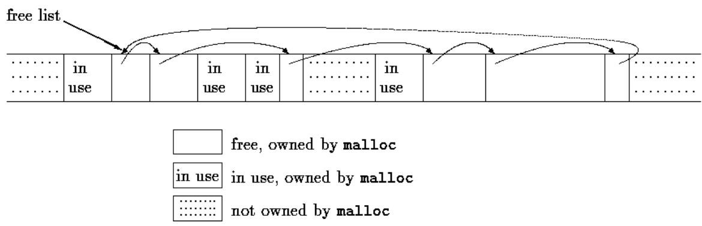
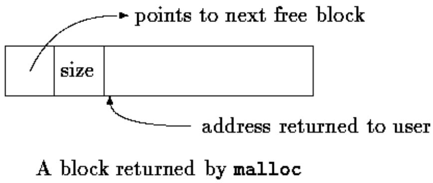

## Chapter 8 - The UNIX System Interface

The UNIX operating system provides its services through a set of system calls, which are in effect functions within the operating system that may be called by user programs. This chapter describes how to use some of the most important system calls from C programs. If you use UNIX, this should be directly helpful, for it is sometimes necessary to employ system calls for maximum efficiency, or to access some facility that is not in the library. Even if you use C on a different operating system, however, you should be able to glean insight into C programming from studying these examples; although details vary, similar code will be found on any system. Since the ANSI C library is in many cases modeled on UNIX facilities, this code may help your understanding of the library as well. 

UNIX 操作系统通过一组系统调用（system calls）提供服务，它们实际上是操作系统中可以被用户程序调用的函数。本章描述如何在 C 程序中使用一些最重要的系统调用。如果你使用 UNIX，这应当直接有所帮助，因为有时为了获得最大效率，或为了访问库中不具备的设施，必须使用系统调用。即使你在不同的操作系统上使用 C，通过研究这些例子你也应当能对 C 编程有所领悟；虽然细节不同，但在任何系统上都能找到类似的代码。由于 ANSI C 库在很多情况下是模仿 UNIX 设施建模的，这些代码也可能有助于你对库的理解。

This chapter is divided into three major parts: input/output, file system, and storage allocation. The first two parts assume a modest familiarity with the external characteristics of UNIX systems. 

本章分为三个主要部分：输入/输出、文件系统和存储分配。前两部分假定对 UNIX 系统的外部特性有适度的熟悉。

Chapter 7 was concerned with an input/output interface that is uniform across operating systems. On any particular system the routines of the standard library have to be written in terms of the facilities provided by the host system. In the next few sections we will describe the UNIX system calls for input and output, and show how parts of the standard library can be implemented with them. 

第 7 章讨论的是在各操作系统之间统一的输入/输出接口。在任何特定系统上，标准库的例程都必须基于宿主系统提供的设施来编写。在接下来几节中，我们将描述用于输入输出的 UNIX 系统调用，并展示如何用它们实现标准库的一部分。

## 8.1 File Descriptors

In the UNIX operating system, all input and output is done by reading or writing files, because all peripheral devices, even keyboard and screen, are files in the file system. This means that a single homogeneous interface handles all communication between a program and peripheral devices. 

在 UNIX 操作系统中，所有的输入输出都是通过读文件或写文件完成的，因为所有外围设备，甚至键盘和屏幕，都是文件系统中的文件。这意味着一个单一的同构接口处理程序与外围设备之间的所有通信。

In the most general case, before you read and write a file, you must inform the system of your intent to do so, a process called opening the file. If you are going to write on a file it may also be necessary to create it or to discard its previous contents. The system checks your right to do so (Does the file exist? Do you have permission to access it?) and if all is well, returns to the program a small non-negative integer called a file descriptor. Whenever input or output is to be done on the file, the file descriptor is used instead of the name to identify the file. (A file descriptor is analogous to the file pointer used by the standard library, or to the file handle of MS-DOS.) All information about an open file is maintained by the system; the user program refers to the file only by the file descriptor. 

在最一般的情况下，在读写文件之前，你必须把你的意图告知系统，这一过程称为打开文件（opening the file）。如果你要写一个文件，可能还需要创建它或丢弃它以前的内容。系统检查你是否有权这样做（文件存在吗？你有访问权限吗？），如果一切正常，就向程序返回一个小的非负整数，称为文件描述符（file descriptor）。今后只要对该文件做输入输出，就用文件描述符（而不是名字）来标识文件。（文件描述符类似于标准库使用的文件指针，或 MS-DOS 的文件句柄。）打开文件的所有信息都由系统维护；用户程序仅通过文件描述符引用文件。

Since input and output involving keyboard and screen is so common, special arrangements exist to make this convenient. When the command interpreter (the "shell") runs a program, three files are open, with file descriptors 0, 1, and 2, called the standard input, the standard output, and the standard error. If a program reads 0 and writes 1 and 2, it can do input and output without worrying about opening files. 

由于涉及键盘和屏幕的输入输出非常普遍，系统做了特殊安排使其便于使用。当命令解释程序（“shell”）运行一个程序时，有三个文件是打开的，其文件描述符为 0、1、2，分别称为标准输入、标准输出和标准错误。如果程序从 0 读并往 1 和 2 写，它就可以做输入输出而不必操心打开文件。

The user of a program can redirect I/O to and from files with < and >: 

程序的用户可以用 < 和 > 把 I/O 重定向到文件或从文件重定向：

```txt
prog <infile >outfile 
```

In this case, the shell changes the default assignments for the file descriptors 0 and 1 to the named files. Normally file descriptor 2 remains attached to the screen, so error messages can go there. Similar observations hold for input or output associated with a pipe. In all cases, the file assignments are changed by the shell, not by the program. The program does not know where its input comes from nor where its output goes, so long as it uses file 0 for input and 1 and 2 for output. 

在这种情况下，shell 把文件描述符 0 和 1 的默认指派改为命名的文件。通常文件描述符 2 保持连接到屏幕，错误信息就可以显示在那里。与管道相关的输入输出也遵循类似的规则。在所有情况下，文件指派都是由 shell 而不是由程序改变的。只要程序用文件 0 作为输入、用 1 和 2 作为输出，它就不知道自己的输入来自何处、输出去往何方。

## 8.2 Low Level I/O - Read and Write

Input and output uses the read and write system calls, which are accessed from C programs through two functions called read and write. For both, the first argument is a file descriptor. The second argument is a character array in your program where the data is to go to or to come from. The third argument is the number is the number of bytes to be transferred. 

输入输出使用 read 和 write 系统调用，在 C 程序中通过两个名为 read 和 write 的函数访问它们。对两者而言，第一个参数都是文件描述符。第二个参数是程序中的字符数组，数据要送往或来自那里。第三个参数是要传输的字节数。

```c
int n_read = read(int fd, char *buf, int n);
int n_written = write(int fd, char *buf, int n); 
```

Each call returns a count of the number of bytes transferred. On reading, the number of bytes returned may be less than the number requested. A return value of zero bytes implies end of file, and -1 indicates an error of some sort. For writing, the return value is the number of bytes written; an error has occurred if this isn't equal to the number requested. 

每次调用都返回传输的字节数。在读的情况下，返回的字节数可能小于所请求的数量。返回值为零字节意味着文件末尾，-1 表示出现了某种错误。对写而言，返回值是写出的字节数；如果它不等于所请求的数量，就发生了错误。

Any number of bytes can be read or written in one call. The most common values are 1, which means one character at a time ("unbuffered"), and a number like 1024 or 4096 that corresponds to a physical block size on a peripheral device. Larger sizes will be more efficient because fewer system calls will be made. 

一次调用可以读或写任意数量的字节。最常见的值是 1，表示每次一个字符（“无缓冲”），以及像 1024 或 4096 这样对应于外围设备物理块大小的数字。更大的长度效率更高，因为系统调用次数更少。

Putting these facts together, we can write a simple program to copy its input to its output, the equivalent of the file copying program written for Chapter 1. This program will copy anything to anything, since the input and output can be redirected to any file or device. 

把这些事实合在一起，我们可以编写一个把输入复制到输出的简单程序，它等同于第 1 章所写的文件复制程序。这个程序可以把任何东西复制给任何东西，因为输入和输出可以重定向到任何文件或设备。

```c
#include "syscalls.h"
main() /* copy input to output */
{
    char buf[BUFSIZ];
    int n;

    while ((n = read(0, buf, BUFSIZ)) > 0)
        write(1, buf, n);
    return 0;
} 
```

We have collected function prototypes for the system calls into a file called syscalls.h so we can include it in the programs of this chapter. This name is not standard, however. 

我们把系统调用的函数原型收集到一个名为 syscalls.h 的文件中，以便在本章的程序中包含它。不过这个名字不是标准的。

The parameter BUFSIZ is also defined in syscalls.h; its value is a good size for the local system. If the file size is not a multiple of BUFSIZ, some read will return a smaller number of bytes to be written by write; the next call to read after that will return zero. 

参数 BUFSIZ 也在 syscalls.h 中定义；它的值对本地系统来说是一个合适的大小。如果文件大小不是 BUFSIZ 的倍数，某次 read 将返回较少的字节数，随后由 write 写出；其后对 read 的下一次调用将返回零。

It is instructive to see how read and write can be used to construct higher-level routines like getchar, putchar, etc. For example, here is a version of getchar that does unbuffered input, by reading the standard input one character at a time. 

看看 read 和 write 如何用来构造像 getchar、putchar 等更高级的例程是很有启发性的。例如，下面是一个执行无缓冲输入的 getchar 版本，它每次从标准输入读取一个字符。

```c
#include "syscalls.h"
/* getchar: unbuffered single character input */
int getchar(void)
{
    char c;
    return (read(0, &c, 1) == 1) ? (unsigned char) c : EOF;
} 
```

c must be a char, because read needs a character pointer. Casting c to unsigned char in the return statement eliminates any problem of sign extension. 

c 必须是 char，因为 read 需要一个字符指针。在 return 语句中把 c 强制转换为 unsigned char 消除了符号扩展的任何问题。

The second version of getchar does input in big chunks, and hands out the characters one at a time. 

getchar 的第二个版本按大块进行输入，然后一次一个字符地分发它们。

```c
#include "syscalls.h"

/* getchar: simple buffered version */
int getchar(void)
{
    static char buf[BUFSIZ];
    static char *bufp = buf;
    static int n = 0;

    if (n == 0) { /* buffer is empty */
        n = read(0, buf, sizeof buf);
        bufp = buf;
    }
    return (--n >= 0) ? (unsigned char) *bufp++ : EOF;
} 
```

If these versions of getchar were to be compiled with <stdio.h> included, it would be necessary to #undef the name getchar in case it is implemented as a macro. 

如果要在包含 <stdio.h> 的情况下编译这些版本的 getchar，就必须 #undef 名字 getchar，以防它被实现为宏。

## 8.3 Open, Creat, Close, Unlink

Other than the default standard input, output and error, you must explicitly open files in order to read or write them. There are two system calls for this, open and creat [sic]. 

除了默认的标准输入、输出和错误之外，要读写其他文件都必须显式地打开文件。为此有两个系统调用：open 和 creat [原文如此]。

open is rather like the fopen discussed in Chapter 7, except that instead of returning a file pointer, it returns a file descriptor, which is just an int. open returns -1 if any error occurs. 

open 与第 7 章讨论过的 fopen 相当类似，只是它返回的是文件描述符（只是一个 int）而不是文件指针。任何错误发生时 open 返回 -1。

```c
#include <fcntl.h>

int fd;
int open(char *name, int flags, int perms);

fd = open(name, flags, perms);
```

As with fopen, the name argument is a character string containing the filename. The second argument, flags, is an int that specifies how the file is to be opened; the main values are

与 fopen 一样，name 参数是包含文件名的字符串。第二个参数 flags 是一个 int，指定文件以何种方式打开；主要取值有

```txt
O_RDONLY     open for reading only
O_WRONLY     open for writing only
O_RDWR     open for both reading and writing 
```

These constants are defined in <fcntl.h> on System V UNIX systems, and in <sys/file.h> on Berkeley (BSD) versions. 

在 System V UNIX 系统上这些常量定义在 <fcntl.h> 中，在 Berkeley (BSD) 版本中定义在 <sys/file.h> 中。

To open an existing file for reading, 

要打开一个已存在的文件进行读取，

```c
fd = open(name, O_RDONLY, 0);
```

The perms argument is always zero for the uses of open that we will discuss. 

对于我们这里讨论的 open 用法，perms 参数总是零。

It is an error to try to open a file that does not exist. The system call creat is provided to create new files, or to re-write old ones. 

试图打开一个不存在的文件是错误的。系统调用 creat 用于创建新文件或重写旧文件。

```c
int creat(char *name, int perms); 
```

```c
fd = creat(name, perms); 
```

returns a file descriptor if it was able to create the file, and -1 if not. If the file already exists, creat will truncate it to zero length, thereby discarding its previous contents; it is not an error to creat a file that already exists. 

如果能创建文件则返回文件描述符，否则返回 -1。如果文件已存在，creat 会把它截断为零长度，从而丢弃其以前的内容；creat 一个已存在的文件不是错误。

If the file does not already exist, creat creates it with the permissions specified by the perms argument. In the UNIX file system, there are nine bits of permission information associated with a file that control read, write and execute access for the owner of the file, for the owner's group, and for all others. Thus a three-digit octal number is convenient for specifying the permissions. For example, 0775 specifies read, write and execute permission for the owner, and read and execute permission for the group and everyone else. 

如果文件不存在，creat 就用 perms 参数指定的权限创建它。在 UNIX 文件系统中，每个文件关联九位权限信息，控制文件所有者、所有者所在组以及所有其他人的读、写和执行访问。因此，用一个三位八进制数来指定权限是很方便的。例如，0775 表示对所有者开放读、写和执行权限，对组和其他所有人开放读和执行权限。

To illustrate, here is a simplified version of the UNIX program cp, which copies one file to another. Our version copies only one file, it does not permit the second argument to be a directory, and it invents permissions instead of copying them. 

为了说明，下面给出 UNIX 程序 cp 的简化版本，它把一个文件复制到另一个。我们的版本只复制一个文件，不允许第二个参数是目录，并且自行设定权限而不是复制原文件的权限。

```c
#include <stdio.h>
#include <fcntl.h>
#include "syscalls.h"
#define PERMS 0666    /* RW for owner, group, others */

void error(char *, ...);

/* cp: copy f1 to f2 */
main(int argc, char *argv[])
{
    int f1, f2, n;
    char buf[BUFSIZ];

    if (argc != 3)
        error("Usage: cp from to");
    if ((f1 = open(argv[1], O_RDONLY, 0)) == -1)
        error("cp: can't open %s", argv[1]);
    if ((f2 = creat(argv[2], PERMS)) == -1)
        error("cp: can't create %s, mode %03o", argv[2], PERMS);
    while ((n = read(f1, buf, BUFSIZ)) > 0)
        if (write(f2, buf, n) != n)
            error("cp: write error on file %s", argv[2]);
    return 0;
} 
```

This program creates the output file with fixed permissions of 0666. With the stat system call, described in Section 8.6, we can determine the mode of an existing file and thus give the same mode to the copy. 

该程序以固定的权限 0666 创建输出文件。使用 8.6 节描述的 stat 系统调用，我们可以确定已有文件的模式，从而把同样的模式赋予副本。

Notice that the function error is called with variable argument lists much like printf. The implementation of error illustrates how to use another member of the printf family. The standard library function vprintf is like printf except that the variable argument list is replaced by a single argument that has been initialized by calling the va_start macro. Similarly, vfprintf and vsprintf match fprintf and sprintf. 

注意，函数 error 以类似于 printf 的变长参数表方式被调用。error 的实现演示了如何使用 printf 家族的另一个成员。标准库函数 vprintf 与 printf 相同，只是变长参数表被一个通过调用 va_start 宏初始化的单个参数所替代。类似地，vfprintf 和 vsprintf 对应于 fprintf 和 sprintf。

```c
#include <stdio.h>
#include <stdarg.h>

/* error: print an error message and die */
void error(char *fmt, ...)
{
    va_list args;

    va_start(args, fmt);
    fprintf(stderr, "error: ");
    vprintf(stderr, fmt, args);
    fprintf(stderr, "\n");
    va_end(args);
    exit(1);
} 
```

There is a limit (often about 20) on the number of files that a program may open simultaneously. Accordingly, any program that intends to process many files must be prepared to re-use file descriptors. The function close(int fd) breaks the connection between a file descriptor and an open file, and frees the file descriptor for use with some other file; it corresponds to fclose in the standard library except that there is no buffer to flush. Termination of a program via exit or return from the main program closes all open files. 

程序可以同时打开的文件数有一个限制（通常约为 20）。因此，打算处理许多文件的任何程序都必须准备重用文件描述符。函数 close(int fd) 断开文件描述符与打开文件之间的连接，释放该文件描述符供其他文件使用；它对应于标准库中的 fclose，只是没有缓冲区需要冲刷。程序通过 exit 终止或从 main 返回时，会关闭所有打开的文件。

The function unlink(char *name) removes the file name from the file system. It corresponds to the standard library function remove. 

函数 unlink(char *name) 从文件系统中删除文件 name。它对应于标准库函数 remove。

Exercise 8-1. Rewrite the program cat from Chapter 7 using read, write, open, and close instead of their standard library equivalents. Perform experiments to determine the relative speeds of the two versions. 

练习 8-1. 用 read、write、open 和 close 而不是它们的标准库等价物重写第 7 章的 cat 程序。做实验确定两个版本的相对速度。

## 8.4 Random Access - Lseek

Input and output are normally sequential: each read or write takes place at a position in the file right after the previous one. When necessary, however, a file can be read or written in any arbitrary order. The system call lseek provides a way to move around in a file without reading or writing any data: 

输入输出通常是顺序的：每次读或写都发生在文件中紧随上一次读写的位置之后。但必要时，也可以按任意顺序读写文件。系统调用 lseek 提供了一种在文件中移动而不读写任何数据的方法：

```c
long lseek(int fd, long offset, int origin); 
```

sets the current position in the file whose descriptor is fd to offset, which is taken relative to the location specified by origin. Subsequent reading or writing will begin at that position. origin can be 0, 1, or 2 to specify that offset is to be measured from the beginning, from the current position, or from the end of the file respectively. For example, to append to a file (the redirection >> in the UNIX shell, or "a" for fopen), seek to the end before writing: 

它把描述符为 fd 的文件的当前位置设为 offset，offset 是相对于 origin 指定的位置而言的。随后的读写将从该位置开始。origin 可以是 0、1 或 2，分别指定 offset 从文件开头、从当前位置或从文件末尾算起。例如，要向文件追加内容（UNIX shell 中的重定向 >>，或 fopen 的 "a"），写之前先定位到末尾：

```c
lseek(fd, 0L, 2); 
```

To get back to the beginning ("rewind"), 

要回到开头（“反绕”），

```c
lseek(fd, 0L, 0); 
```

Notice the 0L argument; it could also be written as (long) 0 or just as 0 if lseek is properly declared. 

注意参数 0L；如果 lseek 声明得当，它也可以写成 (long) 0，或者就写成 0。

With lseek, it is possible to treat files more or less like arrays, at the price of slower access. For example, the following function reads any number of bytes from any arbitrary place in a file. It returns the number read, or -1 on error. 

使用 lseek，可以把文件或多或少当作数组来对待，代价是访问变慢。例如，下面的函数从文件的任意位置读取任意数量的字节。它返回读到的字节数，出错时返回 -1。

```c
#include "syscalls.h"
/*get: read n bytes from position pos */
int get(int fd, long pos, char *buf, int n)
{
    if (lseek(fd, pos, 0) >= 0) /* get to pos */
        return read(fd, buf, n);
    else 
        return -1;
} 
```

The return value from lseek is a long that gives the new position in the file, or -1 if an error occurs. The standard library function fseek is similar to lseek except that the first argument is a FILE * and the return is non-zero if an error occurred. 

lseek 的返回值是一个 long，给出文件中的新位置，出错时返回 -1。标准库函数 fseek 与 lseek 类似，只是第一个参数是 FILE *，并且出错时返回非零值。

## 8.5 Example - An implementation of Fopen and Getc

Let us illustrate how some of these pieces fit together by showing an implementation of the standard library routines fopen and getc. 

让我们通过展示标准库例程 fopen 和 getc 的一个实现，来说明这些部件是如何装配在一起的。

Recall that files in the standard library are described by file pointers rather than file descriptors. A file pointer is a pointer to a structure that contains several pieces of information about the file: a pointer to a buffer, so the file can be read in large chunks; a count of the number of characters left in the buffer; a pointer to the next character position in the buffer; the file descriptor; and flags describing read/write mode, error status, etc. 

回忆一下，标准库中的文件是用文件指针而不是文件描述符来描述的。文件指针是指向一个结构的指针，该结构包含文件的多项信息：指向缓冲区的指针，以便文件可以按大块读取；缓冲区中剩余字符的计数；缓冲区中下一个字符位置的指针；文件描述符；以及描述读/写模式、错误状态等的标志。

The data structure that describes a file is contained in <stdio.h>, which must be included (by #include) in any source file that uses routines from the standard input/output library. It is also included by functions in that library. In the following excerpt from a typical <stdio.h>, names that are intended for use only by functions of the library begin with an underscore so they are less likely to collide with names in a user's program. This convention is used by all standard library routines. 

描述文件的数据结构包含在 <stdio.h> 中，任何使用标准输入输出库例程的源文件都必须（用 #include）包含它。该库中的函数也会包含它。在下面这个典型 <stdio.h> 的摘录中，仅供库函数使用的名字以下划线开头，这样就不容易与用户程序中的名字冲突。所有标准库例程都采用这一约定。

```c
#define NULL 0
#define EOF (-1)
#define BUFSIZ 1024
#define OPEN_MAX 20 /* max #files open at once */
typedef struct _iobuf {
    int cnt;    /* characters left */
    char *ptr;    /* next character position */
    char *base;    /* location of buffer */
    int flag;    /* mode of file access */
    int fd;    /* file descriptor */
} FILE; 
```

```c
extern FILE _iob[OPEN_MAX];

#define stdin (&_iob[0])
#define stdout (&_iob[1])
#define stderr (&_iob[2])

enum _flags {
    _READ = 01, /* file open for reading */
    _WRITE = 02, /* file open for writing */
    _UNBUF = 04, /* file is unbuffered */
    _EOF = 010, /* EOF has occurred on this file */
    _ERR = 020 /* error occurred on this file */
};

int _fillbuf(FILE *);
int _flushbuf(int, FILE *);

#define feof(p) ((p)->flag & _EOF) != 0)
#define ferror(p) ((p)->flag & _ERR) != 0)
#define fileno(p) ((p)->fd)

#define getc(p) (--(p)->cnt >= 0 \
? (unsigned char) *(p)->ptr++ : _fillbuf(p))
#define putc(x,p) (--(p)->cnt >= 0 \
? *(p)->ptr++ = (x) : _flushbuf((x),p))

#define getchar()    getc(stdin)
#define putchar(x)    putc((x), stdout) 
```

The getc macro normally decrements the count, advances the pointer, and returns the character. (Recall that a long #define is continued with a backslash.) If the count goes negative, however, getc calls the function _fillbuf to replenish the buffer, re-initialize the structure contents, and return a character. The characters are returned unsigned, which ensures that all characters will be positive. 

getc 宏通常递减计数、前移指针并返回字符。（回忆一下，长的 #define 用反斜杠续行。）但如果计数变为负数，getc 就调用函数 _fillbuf 来补充缓冲区、重新初始化结构内容并返回一个字符。字符以 unsigned 形式返回，以确保所有字符都是正值。

Although we will not discuss any details, we have included the definition of putc to show that it operates in much the same way as getc, calling a function _flushbuf when its buffer is full. We have also included macros for accessing the error and end-of-file status and the file descriptor. 

虽然我们不讨论任何细节，但还是包含了 putc 的定义，以表明它的运作方式与 getc 基本相同，在其缓冲区满时调用函数 _flushbuf。我们还包含了访问错误和文件末尾状态以及文件描述符的宏。

The function fopen can now be written. Most of fopen is concerned with getting the file opened and positioned at the right place, and setting the flag bits to indicate the proper state. fopen does not allocate any buffer space; this is done by _fillbuf when the file is first read. 

现在可以编写 fopen 了。fopen 的主要工作是把文件打开并定位到正确的位置，并设置标志位以指示正确的状态。fopen 不分配任何缓冲区空间；这是在文件第一次被读时由 _fillbuf 完成的。

```c
#include <fcntl.h>
#include "syscalls.h"
#define PERMS 0666    /* RW for owner, group, others */

FILE *fopen(char *name, char *mode)
{
    int fd;
    FILE *fp;

    if (*mode != 'r' && *mode != 'w' && *mode != 'a')
        return NULL;
    for (fp = _iob; fp < _iob + OPEN_MAX; fp++)
        if ((fp->flag & (_READ | _WRITE)) == 0)
            break;    /* found free slot */
    if (fp >= _iob + OPEN_MAX)    /* no free slots */
        return NULL;

    if (*mode == 'w')
        fd = creat(name, PERMS);
    else if (*mode == 'a') {
        if ((fd = open(name, O_WRONLY, 0)) == -1)
            fd = creat(name, PERMS);
        lseek(fd, 0L, 2);
    } else 
        fd = open(name, O_RDONLY, 0);
    if (fd == -1) /* couldn't access name */
        return NULL;
    fp->fd = fd;
    fp->cnt = 0;
    fp->base = NULL;
    fp->flag = (*mode == 'r') ? _READ : _WRITE;
    return fp;
} 
```

This version of fopen does not handle all of the access mode possibilities of the standard, though adding them would not take much code. In particular, our fopen does not recognize the "b" that signals binary access, since that is meaningless on UNIX systems, nor the "+" that permits both reading and writing. 

这个版本的 fopen 没有处理标准中所有可能的访问模式，不过把它们加上并不需要多少代码。特别是，我们的 fopen 不识别表示二进制访问的 “b”（这在 UNIX 系统上没有意义），也不识别允许读写的 “+”。

The first call to getc for a particular file finds a count of zero, which forces a call of fillbuf. If _fillbuf finds that the file is not open for reading, it returns EOF immediately. Otherwise, it tries to allocate a buffer (if reading is to be buffered). 

对特定文件的第一次 getc 调用会发现计数为零，从而迫使调用 _fillbuf。如果 _fillbuf 发现文件没有为读而打开，它立即返回 EOF。否则，它尝试分配一个缓冲区（如果要进行缓冲读）。

Once the buffer is established, _fillbuf calls read to fill it, sets the count and pointers, and returns the character at the beginning of the buffer. Subsequent calls to _fillbuf will find a buffer allocated. 

一旦缓冲区建立起来，_fillbuf 就调用 read 填充它，设置计数和指针，并返回缓冲区开头的字符。对 _fillbuf 的后续调用将发现缓冲区已分配。

```c
#include "syscalls.h"

/* _fillbuf: allocate and fill input buffer */
int _fillbuf(FILE *fp)
{
    int bufsize;

    if ((fp->flag & (_READ | _EOF | _ERR)) != _READ)
        return EOF;
    bufsize = (fp->flag & _UNBUF) ? 1 : BUFSIZ;
    if (fp->base == NULL) /* no buffer yet */
        if ((fp->base = (char *) malloc(bufsize)) == NULL)
            return EOF; /* can't get buffer */
    fp->ptr = fp->base;
    fp->cnt = read(fp->fd, fp->ptr, bufsize);
    if (--fp->cnt < 0) {
        if (fp->cnt == -1)
            fp->flag |= _EOF;
        else 
            fp->flag |= _ERR;
        fp->cnt = 0;
        return EOF;
    }
    return (unsigned char) *fp->ptr++;
} 
```

The only remaining loose end is how everything gets started. The array _iob must be defined and initialized for stdin, stdout and stderr: 

剩下唯一没交代的是一切如何开始。必须定义数组 _iob 并为 stdin、stdout 和 stderr 初始化：

```c
FILE _iob[OPEN_MAX] = {    /* stdin, stdout, stderr */
    { 0, (char *) 0, (char *) 0, _READ, 0 },
    { 0, (char *) 0, (char *) 0, _WRITE, 1 },
    { 0, (char *) 0, (char *) 0, _WRITE | _UNBUF, 2 }
}; 
```

The initialization of the flag part of the structure shows that stdin is to be read, stdout is to be written, and stderr is to be written unbuffered. 

结构中 flag 部分的初始化表明：stdin 用于读，stdout 用于写，stderr 以无缓冲方式写。

Exercise 8-2. Rewrite fopen and _fillbuf with fields instead of explicit bit operations. Compare code size and execution speed. 

练习 8-2. 用字段而不是显式的位操作重写 fopen 和 _fillbuf。比较代码大小和执行速度。

Exercise 8-3. Design and write _flushbuf, fflush, and fclose. 

练习 8-3. 设计并编写 _flushbuf、fflush 和 fclose。

Exercise 8-4. The standard library function 

练习 8-4. 标准库函数

```c
int fseek(FILE *fp, long offset, int origin) 
```

is identical to lseek except that fp is a file pointer instead of a file descriptor and return value is an int status, not a position. Write fseek. Make sure that your fseek coordinates properly with the buffering done for the other functions of the library. 

与 lseek 相同，只是 fp 是文件指针而不是文件描述符，且返回值是 int 状态而不是位置。请编写 fseek。确保你的 fseek 与库中其他函数所做的缓冲正确配合。

## 8.6 Example - Listing Directories

A different kind of file system interaction is sometimes called for - determining information about a file, not what it contains. A directory-listing program such as the UNIX command ls is an example - it prints the names of files in a directory, and, optionally, other information, such as sizes, permissions, and so on. The MS-DOS dir command is analogous. 

有时需要另一种类型的文件系统交互——获取关于文件的信息，而不是文件的内容。像 UNIX 命令 ls 这样的目录列表程序就是一个例子——它打印目录中文件的名字，还可以打印其他信息，如大小、权限等。MS-DOS 的 dir 命令与此类似。

Since a UNIX directory is just a file, ls need only read it to retrieve the filenames. But is is necessary to use a system call to access other information about a file, such as its size. On other systems, a system call may be needed even to access filenames; this is the case on MS-DOS for instance. What we want is provide access to the information in a relatively systemindependent way, even though the implementation may be highly system-dependent. 

由于 UNIX 目录只是一个文件，ls 只需读它就可以检索文件名。但必须使用系统调用才能访问文件的其他信息，例如它的大小。在其他系统上，甚至可能需要系统调用才能访问文件名；MS-DOS 就是如此。我们想要的是以相对独立于系统的方式提供对这些信息的访问，即使实现可能是高度依赖系统的。

We will illustrate some of this by writing a program called fsize. fsize is a special form of ls that prints the sizes of all files named in its commandline argument list. If one of the files is a directory, fsize applies itself recursively to that directory. If there are no arguments at all, it processes the current directory. 

我们将通过编写一个名为 fsize 的程序来说明其中的一部分。fsize 是 ls 的一种特殊形式，它打印命令行参数表中列出的所有文件的大小。如果其中某个文件是目录，fsize 就对该目录递归地应用自身。如果完全没有参数，它就处理当前目录。

Let us begin with a short review of UNIX file system structure. A directory is a file that contains a list of filenames and some indication of where they are located. The "location" is an index into another table called the "inode list." The inode for a file is where all information about the file except its name is kept. A directory entry generally consists of only two items, the filename and an inode number. 

让我们先简要回顾一下 UNIX 文件系统的结构。目录是一个文件，它包含文件名列表以及这些文件位于何处的指示。“位置”是另一个称为“inode 列表”的表中的索引。文件的 inode 保存关于该文件除名字之外的所有信息。目录项一般只由两项组成：文件名和 inode 编号。

Regrettably, the format and precise contents of a directory are not the same on all versions of the system. So we will divide the task into two pieces to try to isolate the non-portable parts. The outer level defines a structure called a Dirent and three routines opendir, readdir, and closedir to provide system-independent access to the name and inode number in a directory entry. We will write fsize with this interface. Then we will show how to implement these on systems that use the same directory structure as Version 7 and System V UNIX; variants are left as exercises. 

遗憾的是，目录的格式和确切内容在系统的各个版本上并不相同。所以我们将把任务分成两部分，以尽量隔离不可移植的部分。外层定义一个称为 Dirent 的结构和三个例程 opendir、readdir、closedir，以提供对目录项中名字和 inode 编号的独立于系统的访问。我们将用这个接口编写 fsize。然后我们将展示如何在那些使用与 Version 7 和 System V UNIX 相同目录结构的系统上实现这些例程；变体留作练习。

The Dirent structure contains the inode number and the name. The maximum length of a filename component is NAME_MAX, which is a system-dependent value. opendir returns a pointer to a structure called DIR, analogous to FILE, which is used by readdir and closedir. This information is collected into a file called dirent.h. 

Dirent 结构包含 inode 编号和名字。文件名成分的最大长度是 NAME_MAX，这是一个依赖于系统的值。opendir 返回一个指向称为 DIR 的结构的指针，类似于 FILE，由 readdir 和 closedir 使用。这些信息收集在一个名为 dirent.h 的文件中。

```c
#define NAME_MAX 14 /* longest filename component; */
    /* system-dependent */

typedef struct {    /* portable directory entry */
    long ino;    /* inode number */
    char name[NAME_MAX+1];    /* name + '\0' terminator */
} Dirent;

typedef struct {    /* minimal DIR: no buffering, etc. */
    int fd;    /* file descriptor for the directory */
    Dirent d;    /* the directory entry */
} DIR;

DIR *opendir(char *dirname);
Dirent *readdir(DIR *dfd);
void closedir(DIR *dfd); 
```

The system call stat takes a filename and returns all of the information in the inode for that file, or -1 if there is an error. That is, 

系统调用 stat 接受一个文件名，返回该文件的 inode 中的所有信息，出错时返回 -1。也就是说，

```c
char *name;
struct stat stbuf;
int stat(char *, struct stat *);
stat(name, &stbuf); 
```

fills the structure stbuf with the inode information for the file name. The structure describing the value returned by stat is in <sys/stat.h>, and typically looks like this: 

它用文件 name 的 inode 信息填充结构 stbuf。描述 stat 返回值的结构在 <sys/stat.h> 中，通常如下所示：

```c
struct stat    /* inode information returned by stat */
{
    dev_t    st_dev;    /* device of inode */
    ino_t    st_ino;    /* inode number */
    short    st_mode;    /* mode bits */
    short    st_nlink;    /* number of links to file */
    short    st_uid;    /* owners user id */
    short    st_gid;    /* owners group id */
    dev_t    st_rdev;    /* for special files */
    off_t    st_size;    /* file size in characters */
    time_t    st_atime;    /* time last accessed */
    time_t    st_mtime;    /* time last modified */
    time_t    st_ctime;    /* time originally created */
}; 
```

Most of these values are explained by the comment fields. The types like dev_t and ino_t are defined in <sys/types.h>, which must be included too. 

这些值大多可以由注释字段说明。像 dev_t 和 ino_t 这样的类型定义在 <sys/types.h> 中，也必须包含它。

The st_mode entry contains a set of flags describing the file. The flag definitions are also included in <sys/types.h>; we need only the part that deals with file type: 

st_mode 项包含一组描述该文件的标志。标志定义也包含在 <sys/types.h> 中；我们只需要与文件类型有关的部分：

```c
#define S_IFMT 0160000 /* type of file: */
#define S_IFDIR 0040000 /* directory */
#define S_IFCHR 0020000 /* character special */
#define S_IFBLK 0060000 /* block special */
#define S_IFREG 0010000 /* regular */
/* ... */ 
```

Now we are ready to write the program fsize. If the mode obtained from stat indicates that a file is not a directory, then the size is at hand and can be printed directly. If the name is a directory, however, then we have to process that directory one file at a time; it may in turn contain sub-directories, so the process is recursive. 

现在可以编写程序 fsize 了。如果从 stat 获得的模式表明文件不是目录，那么大小已经到手，可以直接打印。但如果名字是目录，我们就必须逐个文件地处理该目录；它可能又包含子目录，所以这个过程是递归的。

The main routine deals with command-line arguments; it hands each argument to the function fsize. 

main 例程处理命令行参数；它把每个参数交给函数 fsize。

```c
#include <stdio.h>
#include <string.h>
#include "syscalls.h"
#include <fcntl.h>    /* flags for read and write */
#include <sys/types.h>    /* typedefs */
#include <sys/stat.h>    /* structure returned by stat */
#include "dirent.h"

void fsize(char *);

/* print file name */
main(int argc, char **argv)
{
    if (argc == 1)    /* default: current directory */
        fsize(".");
    else
        while (--argc > 0)
            fsize(*++argv);
    return 0;
} 
```

The function fsize prints the size of the file. If the file is a directory, however, fsize first calls dirwalk to handle all the files in it. Note how the flag names S_IFMT and S_IFDIR are used to decide if the file is a directory. Parenthesization matters, because the precedence of & is lower than that of ==. 

函数 fsize 打印文件的大小。但如果文件是目录，fsize 就先调用 dirwalk 来处理其中的所有文件。注意标志名 S_IFMT 和 S_IFDIR 如何用来判断文件是否为目录。加括号很重要，因为 & 的优先级低于 ==。

```c
int stat(char *, struct stat *);
void dirwalk(char *, void (*fcn)(char *));

/* fsize: print the name of file "name" */
void fsize(char *name)
{
    struct stat stbuf;

    if (stat(name, &stbuf) == -1) {
        fprintf(stderr, "fsize: can't access %s\n", name);
        return;
    }
    if ((stbuf.st_mode & S_IFMT) == S_IFDIR)
        dirwalk(name, fsize);
    printf("%8ld %s\n", stbuf.st_size, name);
} 
```

The function dirwalk is a general routine that applies a function to each file in a directory. It opens the directory, loops through the files in it, calling the function on each, then closes the directory and returns. Since fsize calls dirwalk on each directory, the two functions call each other recursively. 

函数 dirwalk 是一个通用例程，它把一个函数应用于目录中的每个文件。它打开目录，遍历其中的文件，对每个文件调用该函数，然后关闭目录并返回。由于 fsize 对每个目录调用 dirwalk，这两个函数相互递归调用。

```c
#define MAX_PATH 1024

/* dirwalk: apply fcn to all files in dir */
void dirwalk(char *dir, void (*fcn)(char *))
{
    char name[MAX_PATH];
    Dirent *dp;
    DIR *dfd;

    if ((dfd = opendir(dir)) == NULL) {
        fprintf(stderr, "dirwalk: can't open %s\n", dir);
        return;
    }

    while ((dp = readdir(dfd)) != NULL) {
        if (strcmp(dp->name, ".") == 0
         || strcmp(dp->name, "..") == 0)
            continue; /* skip self and parent */
        if (strlen(dir)+strlen(dp->name)+2 > sizeof(name))
            fprintf(stderr, "dirwalk: name %s %s too long\n", dir, dp->name);
        else {
            sprintf(name, "%s/%s", dir, dp->name);
            (*fcn)(name);
        }
    }

    closedir(dfd);
}
```

Each call to readdir returns a pointer to information for the next file, or NULL when there are no files left. Each directory always contains entries for itself, called ".", and its parent, ".."; these must be skipped, or the program will loop forever. 

每次调用 readdir 都返回一个指向下一个文件信息的指针，没有文件剩余时返回 NULL。每个目录总是包含它自己的表项，称为 "."，以及它的父目录 ".."；这两项必须跳过，否则程序将永远循环。

Down to this last level, the code is independent of how directories are formatted. The next step is to present minimal versions of opendir, readdir, and closedir for a specific system. The following routines are for Version 7 and System V UNIX systems; they use the directory information in the header <sys/dir.h>, which looks like this: 

到这一层为止，代码与目录的格式无关。下一步是针对特定系统给出 opendir、readdir 和 closedir 的最小版本。下面的例程适用于 Version 7 和 System V UNIX 系统；它们使用头文件 <sys/dir.h> 中的目录信息，该头文件如下：

```c
#ifndef DIRSIZ
#define DIRSIZ 14
#endif
struct direct { /* directory entry */
    ino_t d_ino;    /* inode number */
    char d_name[DIRSIZ]; /* long name does not have '\0' */
}; 
```

Some versions of the system permit much longer names and have a more complicated directory structure. 

The type ino_t is a typedef that describes the index into the inode list. It happens to be unsigned short on the systems we use regularly, but this is not the sort of information to embed in a program; it might be different on a different system, so the typedef is better. A complete set of "system" types is found in <sys/types.h>. 

opendir opens the directory, verifies that the file is a directory (this time by the system call fstat, which is like stat except that it applies to a file descriptor), allocates a directory structure, and records the information: 

```c
int fstat(int fd, struct stat *);
/* opendir: open a directory for readdir calls */
DIR *opendir(char *dirname)
{
    int fd;
    struct stat stbuf; 
```

```txt
DIR *dp;
if ((fd = open(dirname, O_RDONLY, 0)) == -1
    || fstat(fd, &stbuf) == -1
    || (stbuf.st_mode & S_IFMT) != S_IFDIR
    || (dp = (DIR *) malloc(sizeof(DIR))) == NULL)
    return NULL;
dp->fd = fd;
return dp; 
```

closedir closes the directory file and frees the space: 

```c
/* closedir: close directory opened by opendir */
void closedir(DIR *dp)
{
    if (dp) {
    close(dp->fd);
    free(dp);
    }
} 
```

Finally, readdir uses read to read each directory entry. If a directory slot is not currently in use (because a file has been removed), the inode number is zero, and this position is skipped. Otherwise, the inode number and name are placed in a static structure and a pointer to that is returned to the user. Each call overwrites the information from the previous one. 

```c
#include <sys/dir.h>    /* local directory structure */

/* readdir:  read directory entries in sequence */
Dirent *readdir(DIR *dp)
{
    struct direct dirbuf;    /* local directory structure */
    static Dirent d;    /* return: portable structure */

    while (read(dp->fd, (char *) &dirbuf, sizeof(dirbuf)) == sizeof(dirbuf)) {
    if (dirbuf.d_ino == 0) /* slot not in use */
    continue;
    d.ino = dirbuf.d_ino;
    strncpy(d.name, dirbuf.d_name, DIRSIZ);
    d.name[DIRSIZ] = '\0';    /* ensure termination */
    return &d;
    }
    return NULL;
} 
```

Although the fsize program is rather specialized, it does illustrate a couple of important ideas. First, many programs are not "system programs"; they merely use information that is maintained by the operating system. For such programs, it is crucial that the representation of the information appear only in standard headers, and that programs include those headers instead of embedding the declarations in themselves. The second observation is that with care it is possible to create an interface to system-dependent objects that is itself relatively systemindependent. The functions of the standard library are good examples. 

Exercise 8-5. Modify the fsize program to print the other information contained in the inode entry. 

## 8.7 Example - A Storage Allocator

In Chapter 5, we presented a vary limited stack-oriented storage allocator. The version that we will now write is unrestricted. Calls to malloc and free may occur in any order; malloc calls upon the operating system to obtain more memory as necessary. These routines illustrate some of the considerations involved in writing machine-dependent code in a relatively machine-independent way, and also show a real-life application of structures, unions and typedef. 

Rather than allocating from a compiled-in fixed-size array, malloc will request space from the operating system as needed. Since other activities in the program may also request space without calling this allocator, the space that malloc manages may not be contiguous. Thus its free storage is kept as a list of free blocks. Each block contains a size, a pointer to the next block, and the space itself. The blocks are kept in order of increasing storage address, and the last block (highest address) points to the first. 




When a request is made, the free list is scanned until a big-enough block is found. This algorithm is called "first fit," by contrast with "best fit," which looks for the smallest block that will satisfy the request. If the block is exactly the size requested it is unlinked from the list and returned to the user. If the block is too big, it is split, and the proper amount is returned to the user while the residue remains on the free list. If no big-enough block is found, another large chunk is obtained by the operating system and linked into the free list. 
当收到分配请求时，会扫描空闲链表，直到找到一个足够大的块。这种算法称为"首次适应"（first fit），与之相对的是"最佳适应"（best fit），后者会寻找能满足请求的最小块。如果块的大小恰好与请求一致，就把它从链表中摘下并返回给用户。如果块太大，就将其分割，把合适的大小返回给用户，剩余部分则留在空闲链表中。如果找不到足够大的块，就向操作系统再申请一大块内存，并链入空闲链表。

Freeing also causes a search of the free list, to find the proper place to insert the block being freed. If the block being freed is adjacent to a free block on either side, it is coalesced with it into a single bigger block, so storage does not become too fragmented. Determining the adjacency is easy because the free list is maintained in order of decreasing address. 
释放操作同样要搜索空闲链表，以找到插入被释放块的合适位置。如果被释放的块与某一侧的空闲块相邻，就把它与那个块合并成一个更大的块，这样存储空间就不会过于碎片化。判断相邻关系很容易，因为空闲链表是按地址递减的顺序维护的。

One problem, which we alluded to in Chapter 5, is to ensure that the storage returned by malloc is aligned properly for the objects that will be stored in it. Although machines vary, for each machine there is a most restrictive type: if the most restrictive type can be stored at a particular address, all other types may be also. On some machines, the most restrictive type is a double; on others, int or long suffices. 
我们在第 5 章中提到过的一个问题是，要确保 malloc 返回的存储空间能满足将要存入其中的对象的对齐要求。虽然机器各不相同，但对每台机器来说都存在一种限制最严格的类型：如果限制最严格的类型能够存放在某个特定的地址上，那么所有其他类型也可以。在某些机器上，限制最严格的类型是 double；在另一些机器上，int 或 long 就足够了。

A free block contains a pointer to the next block in the chain, a record of the size of the block, and then the free space itself; the control information at the beginning is called the "header." To simplify alignment, all blocks are multiples of the header size, and the header is aligned properly. This is achieved by a union that contains the desired header structure and an instance of the most restrictive alignment type, which we have arbitrarily made a long: 
一个空闲块包含一个指向链中下一个块的指针、一个该块大小的记录，之后是空闲空间本身；位于开头的控制信息称为"头部"（header）。为了简化对齐，所有块的大小都是头部大小的整数倍，而且头部本身也要正确对齐。这是通过一个联合（union）来实现的，该联合包含所需的头部结构和一个限制最严格的对齐类型的实例，我们随意地把后者定为 long：

```c
typedef union header {    /* block header: */
    struct {
        union header *ptr; /* next block if on free list */
        unsigned size;    /* size of this block */
    } s;
    Align x;    /* force alignment of blocks */
} Header;
```

The Align field is never used; it just forces each header to be aligned on a worst-case boundary. 
Align 字段从不被使用，它只是强制每个头部都按最坏情况下的边界对齐。

In malloc, the requested size in characters is rounded up to the proper number of header-sized units; the block that will be allocated contains one more unit, for the header itself, and this is the value recorded in the size field of the header. The pointer returned by malloc points at the free space, not at the header itself. The user can do anything with the space requested, but if anything is written outside of the allocated space the list is likely to be scrambled. 
在 malloc 中，以字符计的请求大小会被向上取整为适当数目的、以头部大小为单位的单元数；将要分配的块会多包含一个单元，供头部本身使用，而这个单元数就是记录在头部 size 字段中的值。malloc 返回的指针指向的是空闲空间，而不是头部本身。用户可以对申请到的空间做任何事情，但如果在分配的空间之外写入了任何内容，链表就很可能被搅乱。




The size field is necessary because the blocks controlled by malloc need not be contiguous - it is not possible to compute sizes by pointer arithmetic. 
size 字段是必需的，因为由 malloc 控制的块不一定是连续的——不可能通过指针运算来计算大小。

The variable base is used to get started. If freep is NULL, as it is at the first call of malloc, then a degenerate free list is created; it contains one block of size zero, and points to itself. In any case, the free list is then searched. The search for a free block of adequate size begins at the point (freep) where the last block was found; this strategy helps keep the list homogeneous. If a too-big block is found, the tail end is returned to the user; in this way the header of the original needs only to have its size adjusted. In all cases, the pointer returned to the user points to the free space within the block, which begins one unit beyond the header. 
变量 base 用于起步。如果 freep 为 NULL（就像第一次调用 malloc 时那样），就会创建一个退化的空闲链表；它包含一个大小为零的块，并指向它自身。之后无论如何都会搜索空闲链表。对大小足够的空闲块的搜索，是从上一次找到块的位置（freep）开始的；这一策略有助于保持链表的均匀性。如果找到一个过大的块，就把它的尾部返回给用户；这样，原来的头部只需调整其 size 字段即可。在任何情况下，返回给用户的指针都指向块内的空闲空间，它从头部之后一个单元的位置开始。

```c
static Header base;    /* empty list to get started */
static Header *freep = NULL;    /* start of free list */

/* malloc: general-purpose storage allocator */
void *malloc(unsigned nbytes)
{
    Header *p, *prevp;
    Header *morecore(unsigned);
    unsigned nunits;

    nunits = (nbytes+sizeof(Header)-1)/sizeof(Header) + 1;
    if ((prevp = freep) == NULL) {    /* no free list yet */
        base.s.ptr = freep = prevp = &base;
        base.s.size = 0;
    }
    for (p = prevp->s.ptr; ; prevp = p, p = p->s.ptr) {
        if (p->s.size >= nunits) {    /* big enough */
            if (p->s.size == nunits)    /* exactly */
                prevp->s.ptr = p->s.ptr;
            else {                /* allocate tail end */
                p->s.size -= nunits;
                p += p->s.size;
                p->s.size = nunits;
            }
            freep = prevp;
            return (void *) (p+1);
        }
        if (p == freep)    /* wrapped around free list */
            if ((p = morecore(nunits)) == NULL)
                return NULL;    /* none left */
    }
}
```

The function morecore obtains storage from the operating system. The details of how it does this vary from system to system. Since asking the system for memory is a comparatively expensive operation. we don't want to do that on every call to malloc, so morecore requests al least NALLOC units; this larger block will be chopped up as needed. After setting the size field, morecore inserts the additional memory into the arena by calling free. 
函数 morecore 向操作系统申请存储空间。它具体如何做到这一点因系统而异。由于向系统申请内存是开销相对较大的操作，我们不想在每次调用 malloc 时都这么做，因此 morecore 一次性申请至少 NALLOC 个单元；这个较大的块会按需要被分割。在设置好 size 字段之后，morecore 通过调用 free 把额外的内存插入到分配区中。

The UNIX system call sbrk(n) returns a pointer to n more bytes of storage. sbrk returns -1 if there was no space, even though NULL could have been a better design. The -1 must be cast to char * so it can be compared with the return value. Again, casts make the function relatively immune to the details of pointer representation on different machines. There is still one assumption, however, that pointers to different blocks returned by sbrk can be meaningfully compared. This is not guaranteed by the standard, which permits pointer comparisons only within an array. Thus this version of malloc is portable only among machines for which general pointer comparison is meaningful. 
UNIX 系统调用 sbrk(n) 返回一个指针，指向再多 n 个字节的存储空间。如果没有空间，sbrk 返回 -1，尽管 NULL 本可以是一个更好的设计。必须把 -1 强制转换为 char * 类型，这样它才能与返回值进行比较。再次强调，类型转换使得该函数相对不受不同机器上指针表示细节的影响。不过这里仍然存在一个假设：由 sbrk 返回的、指向不同块的指针之间可以有意义地进行比较。标准并不保证这一点，标准只允许在同一数组之内进行指针比较。因此，malloc 的这个版本只能在那些一般性指针比较确有意义的机器之间移植。

```c
#define NALLOC 1024    /* minimum #units to request */

/* morecore: ask system for more memory */
static Header *morecore(unsigned nu)
{
    char *cp, *sbrk(int);
    Header *up;

    if (nu < NALLOC)
        nu = NALLOC;
    cp = sbrk(nu * sizeof(Header));
    if (cp == (char *) -1)    /* no space at all */
        return NULL;
    up = (Header *) cp;
    up->s.size = nu;
    free((void *)(up+1));
    return freep;
}
```

free itself is the last thing. It scans the free list, starting at freep, looking for the place to insert the free block. This is either between two existing blocks or at the end of the list. In any case, if the block being freed is adjacent to either neighbor, the adjacent blocks are combined. The only troubles are keeping the pointers pointing to the right things and the sizes correct. 
最后来看 free 本身。它从 freep 开始扫描空闲链表，寻找插入空闲块的位置。这一位置要么在两个现有块之间，要么在链表的末尾。无论哪种情况，如果被释放的块与任何一个相邻块邻接，就把相邻的块合并起来。仅有的麻烦在于让指针指向正确的对象，以及让大小保持正确。

```c
/* free: put block ap in free list */
void free(void *ap)
{
    Header *bp, *p;

    bp = (Header *)ap - 1;    /* point to block header */
    for (p = freep; !(bp > p && bp < p->s.ptr); p = p->s.ptr)
        if (p >= p->s.ptr && (bp > p || bp < p->s.ptr))
            break;    /* freed block at start or end of arena */

    if (bp + bp->s.size == p->s.ptr) {    /* join to upper nbr */
        bp->s.size += p->s.ptr->s.size;
        bp->s.ptr = p->s.ptr->s.ptr;
    } else
        bp->s.ptr = p->s.ptr;
    if (p + p->s.size == bp) {    /* join to lower nbr */
        p->s.size += bp->s.size;
        p->s.ptr = bp->s.ptr;
    } else
        p->s.ptr = bp;
    freep = p;
}
```

Although storage allocation is intrinsically machine-dependent, the code above illustrates how the machine dependencies can be controlled and confined to a very small part of the program. The use of typedef and union handles alignment (given that sbrk supplies an appropriate pointer). Casts arrange that pointer conversions are made explicit, and even cope with a badly-designed system interface. Even though the details here are related to storage allocation, the general approach is applicable to other situations as well. 
尽管存储分配在本质上是与机器相关的，但上面的代码说明了如何控制这些机器相关性，并把它们局限在程序中很小的一部分里。使用 typedef 和 union 来处理对齐问题（前提是 sbrk 提供了合适的指针）。类型转换使指针转换显式进行，甚至还能应付设计得很差的系统接口。虽然这里的细节与存储分配有关，但这种一般性的方法同样适用于其他情形。

Exercise 8-6. The standard library function calloc(n,size) returns a pointer to n objects of size size, with the storage initialized to zero. Write calloc, by calling malloc or by modifying it. 
练习 8-6：标准库函数 calloc(n,size) 返回一个指针，指向 n 个大小为 size 的对象，存储空间被初始化为零。请编写 calloc，可以通过调用 malloc 来实现，也可以通过修改 malloc 来实现。

Exercise 8-7. malloc accepts a size request without checking its plausibility; free believes that the block it is asked to free contains a valid size field. Improve these routines so they make more pains with error checking. 
练习 8-7：malloc 接受大小请求时并不检查其合理性；free 认为它被要求释放的块中包含有效的 size 字段。请改进这两个例程，让它们在错误检查上多下功夫。

Exercise 8-8. Write a routine bfree(p,n) that will free any arbitrary block p of n characters into the free list maintained by malloc and free. By using bfree, a user can add a static or external array to the free list at any time.
练习 8-8：编写一个函数 bfree(p,n)，把任意块 p 的 n 个字符释放到由 malloc 和 free 维护的空闲链表中。通过使用 bfree，用户可以随时把一个静态数组或外部数组添加到空闲链表中。 
