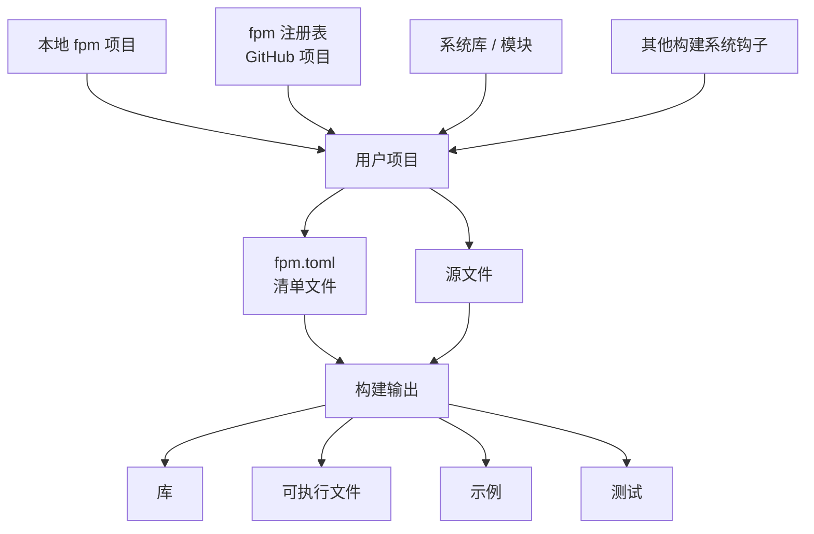

# Fortran Package Manager (fpm) 简介

## 一句话概括

fpm 是 Fortran 语言的官方社区包管理器与构建系统，目标类似 Rust 的 Cargo、Python 的 pip + setuptools，让 Fortran 项目的创建、编译、测试和依赖管理变得简单统一。

---

## 为什么需要 fpm？

在 fpm 出现之前，Fortran 项目的构建方式非常原始：

- **手写 Makefile**：不可移植，平台一变就要重写。
- **CMake**：功能强大但学习曲线陡峭，对新手不友好。
- **自定义脚本**：难以维护，缺乏统一标准。

一个 Fortran 新手不仅要学语言，还得学一套构建工具，门槛极高。更麻烦的是，Fortran 没有统一的依赖管理机制，复用第三方库非常困难。

fpm 就是为了解决这些问题而诞生的。

---

## 核心功能

fpm 通过一个直观的命令行界面，覆盖 Fortran 项目的常见任务：

| 功能 | 说明 |
|------|------|
| 创建新项目 | `fpm new` 自动生成标准目录结构 |
| 编译与链接 | 自动处理源文件依赖和编译顺序 |
| 运行应用与测试 | `fpm run` / `fpm test` |
| 获取第三方依赖 | 自动下载并集成外部包 |
| 管理构建配置 | 支持 debug / release 等构建模式 |

---

## 设计特点

### 1. 清单文件（Manifest）

每个 fpm 项目包含一个 `fpm.toml` 清单文件，使用 TOML 格式，声明：

- 项目名称、版本、作者、许可证
- 源文件目录结构
- 可执行程序与测试
- 第三方依赖及其版本

fpm 会根据清单自动查找源码、可执行文件和单元测试。

### 2. 依赖管理

fpm 提供**一等公民级别的依赖管理**：

- 可以指定依赖的精确版本
- 不同编译器、不同编译选项的构建相互隔离
- 如果项目及其所有依赖都由 fpm 管理，可以实现**可复现构建**

这解决了 Fortran 长期以来 ABI 不兼容、依赖难以复用的痛点。

### 3. 自举（Self-hosting）

fpm 本身用 Fortran 编写，并且可以用自己来构建自己，也可以从一个源文件加一个 Fortran 编译器直接构建。

---

## fpm 工作流（简化）

用户只需在 `fpm.toml` 中声明依赖，fpm 自动完成获取、编译和链接。

---

## 未来规划

- 更细粒度的编译器标志控制（按构建模式区分）
- 原生支持 MPI、OpenMP、OpenACC、Coarrays
- 跨平台图形界面（降低命令行门槛）
- 中央注册表查询与下载
- 集成文档生成

---

## 现状与定位

- **新项目的标准**：fpm 正在成为新的纯 Fortran 科学项目的默认构建工具。
- **可通过主流渠道安装**：Conda、Homebrew、MSYS2 等均已支持。
- **遗留项目仍在过渡**：大量老项目仍使用 Makefile / CMake，fpm 尚未完全取代它们。

---

## 参考资料

- 官方网站：https://fortran-lang.org
- fpm 文档：https://fpm.fortran-lang.org
- GitHub：https://github.com/fortran-lang/fpm
